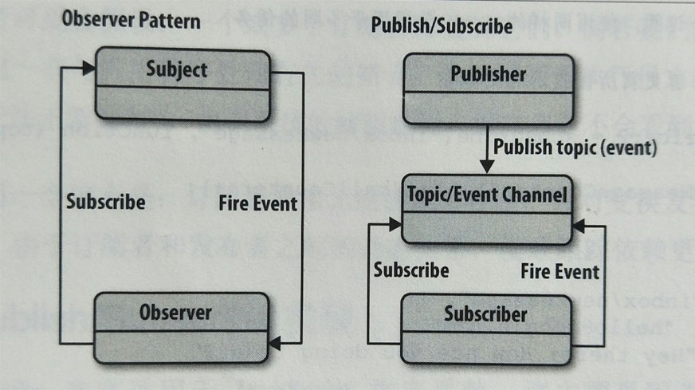

# Observer 观察者模式

一个对象(称为 subject)维持一系列依赖于它(观察者)的对象，将有关状态的任何变更自动通知给它们

- Subject: 目标，维护一系列的观察者，方便添加或删除观察者
- Observer: 观察者，为那些在目标状态发生改变时或得通知的对象提供一个更新接口
- ConcreteSubject: 具体目标，状态发生改变时，向 Observer 发出通知，储存 ConcreteObserver 的状态
- ConcreteObserver: 具体观察者，存储一个指向 ConcreteSubject 的引用，实现 Observer 的更新接口，以实现自身状态与目标的状态保持一致

## Observer 观察者模式实现

```js
// 观察者列表
function ObserverList () {
  this.observerList = []
}
ObserverList.prototype.Add = function (obj) {
  this.observerList.push(obj)
}
ObserverList.prototype.Empty = function () {
  this.observerList = []
}
ObserverList.prototype.Count = function () {
  return this.observerList.length
}
ObserverList.prototype.Get = function (index) {
  if (index > -1 && index < this.observerList.length) {
    return this.observerList[index]
  }
  return null
}
ObserverList.prototype.Insert = function (obj, index) {
  let pointer = -1
  pointer = Max.max(index, 0)
  pointer = Math.min(index, this.observerList.length)

  this.observerList = [...this.observerList.slice(0, index), obj, ...this.observerList.slice(index)]

  return pointer
}
ObserverList.prototype.IndexOf = function (obj, startIndex) {
  var i = startIndex
  var pointer = -1

  while (i < this.observerList.length) {
    if (this.observerList[i] === obj) {
      pointer = i
      break
    }
    i++
  }
  return pointer
}
ObserverList.prototype.RemoveIndexAt = function (index) {
  let pointer = -1
  pointer = Max.max(index, 0)
  pointer = Math.min(index, this.observerList.length)

  this.observerList.splice(pointer, 1)
}

function extend (obj, extension) {
  for (var key in obj) {
    extension[key] = obj[key]
  }
}

// Subject 维护一系列的观察者
function Subject () {
  this.observers = new ObserverList()
}

Subject.prototype.AddObserver = function (observer) {
  this.observers.Add(observer)
}
Subject.prototype.RemoveObserve = function (observer) {
  this.observers.RemoveIndexAt(this.observers.IndexOf(observer, 0))
}
Subject.prototype.Notify = function (context) {
  var observerCount = this.observers.Count()
  for (let i = 0; i < observerCount; i++) {
    this.observers.Get(i).Update(context)
  }
}
// Observer
function Observer () {
  this.update = function () {
    console.log('get notify')
    throw new Error('the update method thould be defined by the observer')
  }
}
```

使用上述功能:

```html
<button id="addNewObserver">Add new Observer checkbox</button>
<input type="checkbox" id="mainCheckbox">
<div id="observersContainer"></div>
```

```js
var controlCheckbox = document.getElementById('mainCheckbox')
var addBtn = document.getElementById('addNewObserver')
var container = document.getElementById('observersContainer')

// 具体目标 Concrete Subject

// 利用 Subject 拓展 controlCheckbox
extend(new Subject(), controlCheckbox)

// 点击 checkbox 会触发通知到观察者上
controlCheckbox['onclick'] = function () {
  controlCheckbox.Notify(controlCheckbox.checked)
}

addBtn['onclick'] = AddNewObserver

function AddNewObserver() {
  // 创建需要添加的新 checkbox
  var check = document.createElement('input')
  check.type = 'checkbox'

  extend(new Observer(), check)
  // 重写更新行为
  check.Update = function (value) {
    this.checked = value
  }

  controlCheckbox.AddObserver(check)
  container.appendChild(check)
}
```

## Observer 观察者模式和 Publish/Subscribe 发布/订阅 模式的区别

Observer 模式要求希望接收到主题通知的观察者(或者对象)必须订阅内容改变的事件

Publish/Subscribe 模式使用了一个 主题/事件 通道，这个通道介于希望接收到通知(订阅者)的对象和激活事件的对象(发布者)之间。该事件系统允许代码定义应用程序的特定事件，这些事件可以传递自定义参数，自定义参数包含订阅者所需要的值。其目的在于避免订阅者与发布者之间产生依赖关系。



> 优点：Observer 模式和 Publish/Subscribe 模式鼓励我们努力思考应用程序不同部分之间的关系。无需使类紧密耦合

> 缺点：如果订阅者执行日志奔溃了，发布者无法看到。订阅者非常无视彼此的存在，并对变换发布者产生的成本视而不见。由于订阅者和发布者之间的动态关系，很难跟踪依赖更新。

## Publish/Subscribe 实现

```js
```