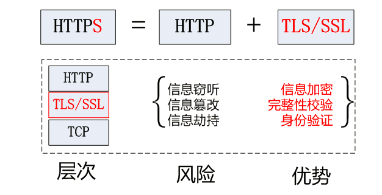

# https 加密机制

## SSL 和 TLS

传输层安全性协议(Transport Layer Security，缩写 TLS），及其前身安全套接层(Secure Sockets Layer,缩写 SSL）是一种安全协议，目的是为互联网通信，提供安全及数据完整性保障。

## HTTPS

HTTPS = HTTP + SSL

HTTPS 协议的主要功能基本都依赖于 TLS/SSL 协议，TLS/SSL 的功能实现主要依赖于三类基本算法

- 散列函数 散列函数验证信息的完整性
- 对称加密 对称加密算法采用协商的密钥对数据加密
- 非对称加密 非对称加密实现身份认证和密钥协商

## 为什么需要加密

因为 HTTP 的内容是明文传输的，明文数据会经过中间代理服务器、路由器、wifi 热点、通信服务运营商等多个物理节点，如果信息在传输过程中被劫持，传输的内容就完全暴露了，它还可以纂改传输的信息并且不被双方察觉，这就是中间人攻击。所以我们才会需要对信息进行加密。

## 什么是对称加密

有一个密钥，它可以对一段内容加密，加密后只能用它才能解密看到原本的内容。

### 对称加密是否可以保证数据安全

如果通信双方都各自持有同一个密钥，并且没有别人知道，这两方的通信安全当然是可以被保证的。但是有个最大的问题，这个密钥怎么让传输的双方知道的同时不被别人知道。

如果由服务器生成一个密钥并传输给浏览器，那这个传输过程中密钥被别人劫持弄到手了怎么办？之后他就可以用密钥解开双方传输的任何内容了，所以这么做当然不行。换种思路？试想一下，如果浏览器内部就预存了网站 A 的密钥并且可以确保除了浏览器和网站 A，不会有任何外人知道该密钥，那么理论上用对称加密是可以的，这样浏览器只要预存好世界上所有 HTTPS 网站的密钥就行啦，可是这样并不现实，所以需要非对称加密。

## 什么是非对称密钥

有两把密钥，通常一把叫做公钥，一把叫做私钥，用公钥加密的内容必须用私钥才能解开，同样，私钥加密的内容只有公钥能解开。

### 非对称加密可以保证数据安全么

鉴于非对称加密的机制，我们可能会有这种思路：服务器先把公钥直接明文传输给浏览器。之后浏览器向服务器传输数据前先用这个公钥加密好再传，这条数据的安全可以得到保障。因为只有服务器有相应的私钥能解开这条数据。

然而由服务器到浏览器的这条路怎么保障安全？如果服务器用它的私钥加密数据传给浏览器，那么浏览器用公钥可以解密它，而这个公钥是一开始通过明文传输给浏览器的，这个公钥被谁劫持到的话，他也能用该公钥解密服务传来的信息了。所以目前似乎只能保证由浏览器向服务器传输数据时的安全性。

## 改良的非对称加密方案

我们已经理解通过一组公钥私钥，已经可以保证单个方向传输的安全性，那用两组公钥私钥，不是就能保证双向传输都安全了?

1. 某网站拥有用于非对称加密的公钥 A、私钥 AA；浏览器拥有用于非对称加密的公钥 B、私钥 BB
2. 浏览器向网站服务器请求，服务器把公钥 A 明文给传输浏览器
3. 浏览器把公钥 B 明文传输给服务器
4. 之后浏览器向服务器传输的所有东西都用公钥 A 加密，服务器收到后用私钥 AA 解密。由于只有服务器拥有这个私钥 AA 可以解密，所以能保证这条数据的安全
5. 服务器向浏览器传输的所有东西都用公钥 B 加密，浏览器收到后用私钥 BB 解密。由于只有浏览器拥有这个私钥 BB 可以解密，所以能保证这条数据的安全

的确可以，但是 HTTPS 并没有采取这种方案，其中最重要的原因是非对称加密算法非常耗时，特别是加密解密一些较大数据的时候有些力不从心，而对称加密快很多。

## 非对称加密+对称加密

既然非对称加密耗时，非对称加密+对称加密结合可以吗？而且得尽量减少非对称加密的次数。当然是可以的，而且非对称加密、解密各只需用一次即可

1. 某网站拥有用于非对称加密的公钥 A、私钥 AA
2. 浏览器向网站服务器请求，服务器把公钥 A 明文给传输浏览器
3. 浏览器随机生成一个用于对称加密的密钥 x，用公钥 A 加密后传给服务器
4. 服务器拿到后用私钥 AA 解密得到密钥 x
5. 这样双方就都拥有密钥 x 了,且别人无法知道它。之后双方所有数据都用密钥 x 加密解密

这样是不是就很完美了，Https 就是 采用的这种方案。但是这样还是会存在漏洞。

## 中间人攻击

中间人的确无法得到浏览器生成的密钥 X，这个密钥本身被公钥 A 加密了，只有服务器才有私钥 AA 解开拿到它。然而中间人却完全不需要拿到密钥 AA 就能干坏事。

1. 某网站拥有用于非对称加密的公钥 A、私钥 AA
2. 浏览器向网站服务器请求，服务器把公钥 A 明文给传输浏览器
3. 中间人劫持到公钥 A，保存下来，把数据包中的公钥 A 替换成自己伪造的公钥 B (它当然也拥有公钥 B 对应的私钥 BB)
4. 浏览器随机生成一个用于对称加密的密钥 x，用公钥 B (浏览器不知道公钥被替换了)加密后传给服务器
5. 中间人劫持后用私钥 BB 解密得到密钥 x，再用公钥 A 加密后传给服务器。服务器拿到后用私钥 AA 解密得到密钥 X。

这样在双方都不会发现异常的情况下，中间人得到了密钥 X。根本原因是浏览器无法确认自己收到的公钥是不是网站自己的。

## 如何证明浏览器收到的公钥一定是该网站的公钥

现实生活中，如果想证明某身份证号一定是你的，怎么办?看身份证。这里政府机构起到了公信的作用，身份证是由它颁发的，它本身的权威可以对一个人的身份信息作出证明。互联网中能不能搞这么个公信机构呢？给网站颁发一个身份证？

## 数字证书

网站在使用 HTTPS 前，需要向"CA 机构"申请颁发一份数字证书，数字证书里有证书持有者、证书持有者的公钥等信息，服务器把证书传输给浏览器，浏览器从证书里取公钥就行了，证书就如身份证一样，可以证明该公钥对应该网站。然而这里又有一个显而易见的问题了，证书本身的传输过程中，如何防止被篡改---即如何证明证书本身的真实性?身份证有一些防伪技术，数字证书也有对应的防伪措施。

## 如何防止数字证书被篡改

我们把证书内容生成一份签名，比对证书内容和签名是否一致就能察觉是否被篡改。这种技术就叫数字签名。

数字签名有两种功效：

- 能确定消息确实是由发送方签名并发出来的，因为别人假冒不了发送方的签名
- 数字签名能确定消息的完整性，证明数据是否未被篡改过

## HTTPS 获取加密密钥的过程

- 首先，客户端发起握手请求，以明文传输请求信息，包含版本信息，加密套件候选列表，压缩算法候选列表，随机数，扩展字段等信息(这个没什么好说的，就是用户在浏览器里输入一个 HTTPS 网址，然后连接到服务端的 443 端口)
- 服务端的配置，采用 HTTPS 协议的服务器必须要有一套数字证书，可以自己制作，也可以向组织申请。区别就是自己颁发的证书需要客户端验证通过才可以继续访问，而使用受信任的公司申请的证书则不会弹出提示页面。这套证书其实就是一对公钥和私钥。如果对公钥不太理解，可以想象成一把钥匙和一个锁头，只是世界上只有你一个人有这把钥匙，你可以把锁头给别人，别人可以用这个锁把重要的东西锁起来，然后发给你，因为只有你一个人有这把钥匙，所以只有你才能看到被这把锁锁起来的东西。
- 服务端返回协商的信息结果，包括选择使用的协议版本 version，选择的加密套件 cipher suite，选择的压缩算法 compression method、随机数 random_S 以及证书。(这个证书其实就是公钥，只是包含了很多信息，如证书的颁发机构，过期时间等等。）
- 客户端验证证书的合法性，包括可信性，是否吊销，过期时间和域名。(这部分工作是由客户端的 SSL/TLS 来完成的，首先会验证公钥是否有效，比如颁发机构、过期时间等等，如果发现异常，则会弹出一个警示框，提示证书存在的问题。如果证书没有问题，那么就生成一个随机值。然后用证书(也就是公钥)对这个随机值进行加密。就好比上面说的，把随机值用锁头锁起来，这样除非有钥匙，不然看不到被锁住的内容。)
- 客户端使用公匙对对称密匙加密，发送给服务端。(这部分传送的是用证书加密后的随机值，目的是让服务端得到这个随机值，以后客户端和服务端的通信就可以通过这个随机值来进行加密解密了。)
- 服务器用私钥解密，拿到对称加密的密匙。(服务端用私钥解密后，得到了客户端传过来的随机值，然后把内容通过该随机值进行对称加密，将信息和私钥通过某种算法混合在一起，这样除非知道私钥，不然无法获取内容，而正好客户端和服务端都知道这个私钥，所以只要加密算法够彪悍，私钥够复杂，数据就够安全。)
- 传输加密后的信息，这部分信息就是服务端用私钥加密后的信息，可以在客户端用随机值解密还原。
- 客户端解密信息，客户端用之前生产的私钥解密服务端传过来的信息，于是获取了解密后的内容。整个过程第三方即使监听到了数据，也束手无策。

## HTTPS 必须在每次请求中都要先在 SSL/TLS 层进行握手传输密钥吗

如果每一次 HTTPS 的请求都需要进行 TLS 的握手，TLS 的握手那么复杂，势必会对通信带来较大的延时，这对注重用户体验的网站来说，是不可接受的。那么有什么办法可以避免这种情况吗？

其实是通过一个 Session Identifier (会话标识符)，该 Session ID 是 TLS 握手中生成的 Session ID。 服务端可以将 Session ID 协商后的信息存起来，浏览器也可以保存 Session ID，并在后续的 Client Hello 中带上它，如果服务端能找到与之匹配的信息，就可以完成一次快速握手。

## HTTPS 中间人攻击

中间人攻击过程如下：

1. 服务器向客户端发送公钥；
2. 攻击者截获公钥，保留在自己手上；
3. 然后攻击者自己生成一个【伪造的】公钥，发给客户端；
4. 客户端收到伪造的公钥后，生成加密 hash（秘钥） 值发给服务器；
5. 攻击者获得加密 hash 值，用自己的私钥解密获得真秘钥；
6. 同时生成假的加密 hash 值，发给服务器；
7. 服务器用私钥解密获得假秘钥；
8. 服务器用假秘钥加密传输信息；

防范方法：服务器在发送浏览器的公钥中加入 CA 证书，浏览器可以验证 CA 证书的有效性；（现有 HTTPS 很难被劫持，除非信任了劫持者的 CA 证书）
