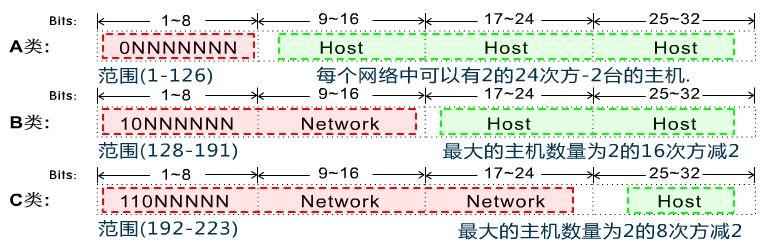

# 网络

## OSI七层模型

Open System Interconnection适用于所有的网络

- 分工带来效能
- 将复杂的流程分解为几个功能相对单一的子进程
- 整个流程更加清晰，复杂问题简单化
- 更容易发现问题并针对性的解决问题
  - 应用层(Application) 提供网络与用户应用软件之间的接口服务(HTTP)
  - 表示层(Presentation) 提供格式化的表示和转换数据服务，如加密和压缩()
  - 会话层(Session) 提供包括访问验证和会话管理在内的建立和维护应用之间通信的机制()
  - 传输层(Transimission) 提供建立、维护和取消传输连接功能，负责可靠地传输数据(TCP)
  - 网络层(Network) 处理网络间路由，确保数据及时传送(路由器)
  - 数据链路层(DataLink) 负责无错传输数据，确认帧、发错重传等(交换机)
  - 物理层(Physics) 提供机械、电气、功能和过程特性(网卡、网线、双绞线、同轴电缆、中继器)

## TCP/IP参考模型

- TCP/IP是传输控制协议/网络互联协议的简称
- 早期的TCP/IP模型是一个四层结构，从下往上依次是网络接口层、互联网层、传输层和应用层
- 后来在使用过程中，借鉴OSI七层参考模型，将网络接口层划分为了物理层和数据链路层，形成五层结构

应用层 -> 传输层 -> 网络层 -> 数据链路层 -> 物理层

### 常用协议

| 层级 | 名称 |	含义 |
| ---- | ---- | ---- |
| 应用层 | HTTP |	超文本传输协议（HTTP，HyperText Transfer Protocol)是互联网上应用最为广泛的一种网络协议 |
| 应用层 | FTP | 文件传输协议（英文：File Transfer Protocol，缩写：FTP）是用于在网络上进行文件传输的一套标准协议，使用客户/服务器模式 |
| 应用层 | TFTP |	(Trivial File Transfer Protocol,简单文件传输协议)是TCP/IP协议族中的一个用来在客户机与服务器之间进行简单文件传输的协议 |
| 应用层 | SMTP | 简单邮件传输协议 (Simple Mail Transfer Protocol, SMTP) 是在Internet传输Email的事实标准 |
| 应用层 | SNMP |	简单网络管理协议（SNMP，Simple Network Management Protocol），由一组网络管理的标准组成，包含一个应用层协议（application layer protocol）、数据库模型（database schema）和一组资源对象,该协议能够支持网络管理系统，用以监测连接到网络上的设备是否有任何引起管理上关注的情况。 |
| 应用层 | DNS | 域名系统（英文：Domain Name System，缩写：DNS）是互联网的一项服务。它作为将域名和IP地址相互映射的一个分布式数据库，能够使人更方便地访问互联网。 |
| 传输层 | TCP	| TCP（Transmission Control Protocol 传输控制协议）是一种面向连接的、可靠的、基于字节流的传输层通信协议 |
| 传输层 | UDP | UDP 是User Datagram Protocol的简称， 中文名是用户数据报协议，是OSI（Open System Interconnection，开放式系统互联） 参考模型中一种无连接的传输层协议，提供面向事务的简单不可靠信息传送服务 |
| 传输层 | ICMP | ICMP（Internet Control Message Protocol）Internet控制报文协议。它是TCP/IP协议簇的一个子协议，用于在IP主机、路由器之间传递控制消息。控制消息是指网络通不通、主机是否可达、路由是否可用等网络本身的消息 |
| 网络层 | IGMP | Internet 组管理协议称为IGMP协议（Internet Group Management Protocol），是因特网协议家族中的一个组播协议。该协议运行在主机和组播路由器之间 |
| 网络层 | IP | 互联网协议地址（英语：Internet Protocol Address，又译为网际协议地址），缩写为IP地址（英语：IP Address），是分配给用户上网使用的网际协议（英语：Internet Protocol, IP）的设备的数字标签 |
| 网络层 | ARP | 地址解析协议，即ARP（Address Resolution Protocol），是根据IP地址获取物理地址的一个TCP/IP协议 |
| 网络层 | RARP | 反向地址转换协议（RARP：Reverse Address Resolution Protocol） 反向地址转换协议（RARP）允许局域网的物理机器从网关服务器的 ARP 表或者缓存上请求其 IP 地址 |

## 网络接口层

- 网络接口层是TCP/IP模型的最底层，负责接收从上一层交来的数据报并将数据报通过底层的物理网络发送出去，比较常见的就是设备的驱动程序，此层没有特定的协议
- 网络接口层又分为物理层和数据链路层

### 物理层

- 计算机在传递数据的时候传递的都是0和1的数字，而物理层关心的是用什么信号来表示0和1，是否可以双向通信，最初的连接如何建立以及完成连接如何终止,物理层是为数据传输提供可靠的环境
- 尽可能的屏蔽掉物理设备和传输媒介，使数据链路层不考虑这些差异，只考虑本层的协议和服务
- 为用户提供在一条物理传输媒体上提供传送和接收比特流的能力
- 需要解决物理连接、维护和释放的问题

数字信号编码

- 非归零编码
- 曼彻斯特编码

### 数据链路层

- 数据链路层是OSI参考模型中的第二层，介乎于物理层和网络层之间
- 数据链路层在物理层提供的服务的基础上向网络层提供服务，其最基本的服务是将源自网络层来的数据可靠地传输到相邻节点的目标机网络层
- 如何将数据组合成数据块，在数据链路层中称这种数据块为帧frame，帧是数据链路层的传送单位
- 如何控制帧在物理信道上的传输，包括如何处理传输差错，如何调节发送速率以使与接收方相匹配，以及在两个网络实体之间提供数据链路通路的建立、维持和释放的管理

#### 以太网

- 以太网（Ethernet）是一种计算机局域网技术。IEEE组织的IEEE 802.3标准制定了以太网的技术标准，它规定了包括物理层的连线、电子信号和介质访问层协议的内容
- 以太网的标准拓扑结构为总线型拓扑
- 以太网仍然使用总线型拓扑和CSMA/CD（Carrier Sense Multiple Access/Collision Detection，即载波多重访问/碰撞侦测）的总线技术
- 以太网实现了网络上无线电系统多个节点发送信息的想法，每个节点必须获取电缆或者信道的才能传送信息
- 每一个节点有全球唯一的48位地址也就是制造商分配给网卡的MAC地址，以保证以太网上所有节点能互相鉴别

#### 总线型拓扑

- 总线型拓扑是采用单根传输作为共用的传输介质,将网络中所有的计算机通过相应的硬件接口和电缆直接连接到这根共享的总线上
- 使用总线型拓扑结构需解决的是确保端用户使用媒体发送数据时不能出现冲突。
- 总线型网络采用载波监听多路访问/冲突检测协议（CSMA/CD)作为控制策略

#### MAC地址

- 在通信过程中是用内置在网卡内的地址来标识计算机身份的
- 每个网卡都有一个全球唯一的地址来标识自己，不会重复
- MAC地址48位的二进制组成，通常分为6段，用16进制表示，前24位为供应商标示，后24位为供应商对网卡的唯一编号

#### 以太网帧格式

- 在以太网链路上的数据包称作以太帧。以太帧起始部分由前导码和帧开始符组成
- 后面紧跟着一个以太网报头，以MAC地址说明目的地址和源地址
- 帧的中部是该帧负载的包含其他协议报头的数据包(例如IP协议)
- 以太帧由一个32位冗余校验码结尾。它用于检验数据传输是否出现损坏

#### ARP协议

- 地址解析协议，即ARP（Address Resolution Protocol），是根据IP地址获取物理地址的一个TCP/IP协议
- 主机发送信息时将包含目标IP地址的ARP请求广播到网络上的所有主机，并接收返回消息，以此确定目标的物理地址；收到返回消息后将该IP地址和物理地址存入本机ARP缓存中并保留一定时间，下次请求时直接查询ARP缓存以节约资源
- 地址解析协议是建立在网络中各个主机互相信任的基础上的，网络上的主机可以自主发送ARP应答消息，其他主机收到应答报文时不会检测该报文的真实性就会将其记入本机ARP缓存
- 由此攻击者就可以向某一主机发送伪ARP应答报文，使其发送的信息无法到达预期的主机或到达错误的主机，这就构成了一个ARP欺骗

## 网络层

位于传输层和网络接口层之间,用于把数据从源主机经过若干个中间节点传送到目标主机,并向传输层提供最基础的数据传输服务,它要提供路由和选址的工作

### 选址

交换机是靠MAC来寻址的，而因为MAC地址是无层次的,所以要靠IP地址来确认计算机的位置,这就是选址

### 路由

在能够选择的多条道路之间选择一条最短的路径就是路由的工作

### IP

在网络中，每台计算机都有一个唯一的地址，方便别人找到它，这个地址称为IP地址

#### IP头部

| 字段 | 说明 |
| --- | --- |
| 版本 | (Version）字段：占4比特。用来表明IP协议实现的版本号，当前一般为IPv4，即0100 |
| 首部长部 | 报头长度（Internet Header Length，IHL）字段：占4比特。是头部占32比特的数字，包括可选项。普通IP数据报（没有任何选项），该字段的值是5，即160比特=20字节。此字段最大值为60字节 |
| 优先级与服务类型 | 占8比特。其中前3比特为优先权子字段（Precedence，现已被忽略）。第8比特保留未用。第4至第7比特分别代表延迟、吞吐量、可靠性和花费。当它们取值为1时分别代表要求最小时延、最大吞吐量、最高可靠性和最小费用。这4比特的服务类型中只能置其中1比特为1。可以全为0，若全为0则表示一般服务。服务类型字段声明了数据报被网络系统传输时可以被怎样处理。例如：TELNET协议可能要求有最小的延迟，FTP协议（数据）可能要求有最大吞吐量，SNMP协议可能要求有最高可靠性，NNTP（Network News Transfer Protocol，网络新闻传输协议）可能要求最小费用，而ICMP协议可能无特殊要求（4比特全为0 |
| 总长度 | 占16比特。指明整个数据报的长度（以字节为单位）。最大长度为65535字节 |
| 标识符 | 占16比特。用来唯一地标识主机发送的每一份数据报。通常每发一份报文，它的值会加1 |
| 标志 | 分为3个字段，依次为保留位、不分片位和更多片位 |
| 标志 | 保留位：一般被置为0 |
| 标志 | 不分片位：表示该数据报是否被分片，如果被置为1，则不能对数据报进行分片，如果要对其进行分片处理，就应将其置为0 |
| 标志 | 更多片位：除了最后一个分片，其他每个组成数据报的片都要将该位置设置为1. |
| 段偏移量 | 占13比特。如果一份数据报要求分段的话，此字段指明该段偏移距原始数据报开始的位置 |
| TTL(Time to Live生存时间) |	该字段用于表示IP数据包的生命周期，可以防止一个数据包在网络中无限循环地发下去。TTL的意思是一个数据包在被丢弃之前在网络中的最大周转时间。该数据包经过的每一个路由器都会检查该字段中的值，当TTL的值为0时此数据包会被丢弃。TTL对应于一个数据包通过路由器的数目，一个数据包每经过一个路由器，TTL将减去1 |
| 协议号 | 占8比特。指明IP层所封装的上层协议类型，如ICMP（1）、IGMP（2） 、TCP（6）、UDP（17）等 |
| 首部校验和 | 检验和是16位的错误检测字段。目的主机和网络中的每个网关都要重新计算报头的校验和，一样表示没有改动过,计算方法是：对头部中每个16比特进行二进制反码求和 |
| 源IP地址 | 该字段用于表示数据包的源地址，指的是发送该数据包的设备的网络地址 |
| 目标IP地址 | 该字段用于表示数据包的目标的地址，指的是接收节点的网络地址 |

#### IP地址格式

- IP地址是一个网络编码，用来确定网络中的一个节点
- IP地址是由32位二进制(32bit)组成

#### IP地址组成

- 网络部分(NETWORK): 标示不同的网络
- 主机部分(HOST): 标示在一个网络中特定的主机

#### IP地址的分类

- IP地址的网络部分是由Internet地址分配机构来统一分配的，这样可以保证IP的唯一性
- ip地址中全为1的ip即255.255.255.255，它称为限制广播地址，如果将其作为数据包的目标地址可以理解为发送到所有网络的所有主机
- ip地址中全为0的ip即0.0.0.0，它表示启动时的ip地址，其含义就是尚未未分配时的ip地址
- 127是用来进行本机测试的，除了127.255.255.255外，其它的127开头的地址都代表本机

#### 公有地址和私有地址

| 分类 | 范围 |
| --- | --- |
| A类私有IP | 10.0.0.0 ~ 10.255.255.255 |
| B类私有IP | 172.16.0.0 ~ 172.31.255.255 |
| C类私有IP	| 192.168.0.0 ~ 192.168.255.255 |

其他范围的IP均为公有IP地址

#### 子网掩码

- 子网掩码(subnet mask)又叫子网络遮罩，它是一种用来指明一个IP地址的哪些位标识的是主机所在的子网，以及哪些位标识的是主机位的掩码。
- 子网掩码不能单独存在，它必须结合IP地址一起使用。
- 子网掩码只有一个作用，就是将某个IP地址划分成网络地址和主机地址两部分。
- 子网掩码也是32个二进制位
- 对应IP的网络部分用1表示
- 对应IP地址的主机部分用0表示
- IP地址和子网掩码做逻辑与运算得到网络地址
  - 0和任何数相与都是0
  - 1和任何数相与都等于任何数本身
- A B C 三类地址都有自己默认的子网掩码
  - A类 255.0.0.0
  - B类 255.255.0.0
  - C类 255.255.255.0

## 传输层

- 位于应用层和网络接口层之间
- 是面向连接的、可靠的的进程到进程通信的协议
- TCP提供全双工服务，即数据可在同一时间双向传播
- TCP将若干个字节构成一个分组，此分组称为报文段(Segment)
- 对可靠性要求高的上层协议，实现可靠性的保证,如果数据丢失、损坏的情况下如何保证可靠性,网络层只管传递数据，成功与否并不关心

- 单工: 单向传输，例如广播，电视
- 半双工: 在同一个时间点内，只能单向通信，例如对讲机
- 全双工: 在任意时间点双方都可以收发数据，例如电话

### 传输层的功能

- 提供了一种端到端的连接

### 协议分类

- TCP(Transimision Control Protocal)
  - 传输控制协议
  - 可靠的、面向连接的协议
  - 传输效率低
- UDP(User Datagram Protocal)
  - 用户数据报协议
  - 不可靠的、无连接的服务
  - 传输效率高

### TCP协议

- 将数据进行分段打包传输
- 对每个数据包编号控制顺序
- 运输中丢失、重发和丢弃处理
- 流量控制避免拥塞

#### TCP数据包封装

- 源端口号和目标端口号，计算机通过端口号识(最大65535)别访问哪个服务,比如http服务或ftp服务，发送方端口号是进行随机端口，目标端口号决定了接收方哪个程序来接收

#### 32位序列号

- 32位序列号: TCP用序列号对数据包进行标记，以便在到达目的地后重新重装，假设当前的序列号为 s，发送数据长度为 l，则下次发送数据时的序列号为 s + l。在建立连接时通常由计算机生成一个随机数作为序列号的初始值

#### 确认应答号

- 确认应答号: 它等于下一次应该接收到的数据的序列号。假设发送端的序列号为 s，发送数据的长度为 l，那么接收端返回的确认应答号也是 s + l。发送端接收到这个确认应答后，可以认为这个位置以前所有的数据都已被正常接收。

#### 首部长度

- 首部长度: TCP首部的长度，单位为 4 字节。如果没有可选字段，那么这里的值就是 5。表示 TCP 首部的长度为 20 字节

#### 控制位

- 控制位: TCP的连接、传输和断开都受这六个控制位的指挥
  - PSH(push急迫位) 缓存区将满，立刻传输速度
  - RST(reset重置位) 连接断了重新连接
  - URG(urgent紧急位) 紧急信号
- 紧急指针: 在 URG(urgent紧急) 控制位为 1 时有效。表示紧急数据的末尾在 TCP 数据部分中的位置。通常在暂时中断通信时使用（比如输入 Ctrl + C）。

#### SYN

- SYN(synchronous建立联机) 同步序号位 TCP建立连接时要将这个值设为1

#### ACK

- ACK(acknowledgement 确认)为1表示确认号

#### FIN

- FIN发送端完成位，提出断开连接的一方把FIN置为1表示要断开连接

#### 窗口值

- 窗口值: 说明本地可接收数据段的数目，这个值的大小是可变的。当网络通畅时将这个窗口值变大加快传输速度，当网络不稳定时减少这个值可以保证网络数据的可靠传输。它是来在TCP传输中进行流量控制的
- 窗口大小: 用于表示从应答号开始能够接受多少个 8 位字节。如果窗口大小为 0，可以发送窗口探测。

#### 差错控制

- 校验和用来做差错控制，TCP校验和的计算包括TCP首部、数据和其它填充字节。在发送TCP数据段时，由发送端计算校验和，当到达目的地时又进行一次检验和计算。如果两次校验和一致说明数据是正确的，否则将认为数据被破坏，接收端将丢弃该数据

#### 握手和断开

- TCP是面向连接的协议，它在源点和终点之间建立虚拟连接，而不是物理连接
- 在数据通信之前，发送端与接收端要先建立连接，等数据发送结束后，双方再断开连接
- TCP连接的每一方都是由一个IP地址和一个端口组成

