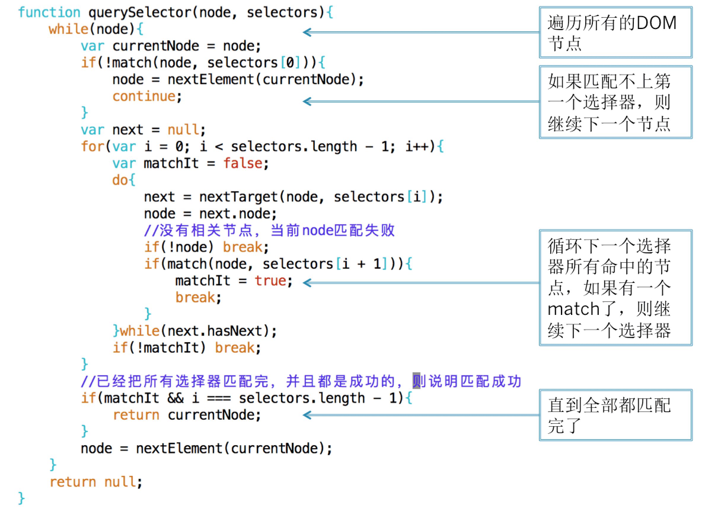

# 前端数据结构与算法

## 1.递归

```js
// 递归的发送请求
var ids = [34112, 98325, 68125];
(function sendRequest() {
  var id = ids.shift();
  if (id) {
    $.ajax({ url: "/get", data: { id } }).always(function() {
      //do sth.
      console.log("finished");
      sendRequest();
    });
  } else {
    console.log("finished");
  }
})();
```

```js
// 模拟 getElementById
function getElementById(node, id) {
  if (!node) return null;
  if (node.id === id) return node;
  for (var i = 0; i < node.childNodes.length; i++) {
    var found = getElementById(node.childNodes[i], id);
    if (found) return found;
  }
  return null;
}
getElementById(document, "d-cal");
```

使用递归的优点是代码简单易懂，缺点是效率比不上非递归的实现。不管是非递归还是递归，它们都是深度优先遍历。

Chrome 浏览器的查找 DOM 实现：

```js
function getByElementId(node, id) {
  //遍历所有的Node
  while (node) {
    if (node.id === id) return node;
    node = nextElement(node);
  }
  return null;
}

function nextElement(node) {
  if (node.children.length) {
    return node.children[0];
  }
  if (node.nextElementSibling) {
    return node.nextElementSibling;
  }
  while (node.parentNode) {
    if (node.parentNode.nextElementSibling) {
      return node.parentNode.nextElementSibling;
    }
    node = node.parentNode;
  }
  return null;
}
```

实际上 getElementById 浏览器是用的一个哈希 map 存储的，根据 id 直接映射到 DOM 结点，而 getElementsByClassName 就是用的这样的非递归查找。

## 2.复杂选择器的查 DOM

实现一个 document.querySelector:

```js
document.querySelector(".mls-info > div .copyright-content");
```

首先把复杂选择器做一个解析，序列为以下格式：

```js
//把selector解析为
var selectors = [
  { relation: "descendant", matchType: "class", value: "copyright-content" },
  { relation: "child", matchType: "tag", value: "div" },
  { relation: "subSelector", matchType: "class", value: "mls-info" },
];
```

从右往左，第一个 selector 是 `.copyright-content`，它是一个类选择器，所以它的 matchType 是 class，它和第二个选择器是祖先和子孙关系，因此它的 relation 是 descendant；同理第二个选择器的 matchType 是 tag，而 relation 是 child，表示是第三个选择器的直接子结点；第三个选择器也是 class，但是它没有下一个选择器了，relation 用 subSelector 表示。

matchType 的作用就在于用来比较当前选择器是否 match，如下代码所示：

```js
function match(node, selector) {
  if (node === document) return false;
  switch (selector.matchType) {
    //如果是类选择器
    case "class":
      return (
        node.className
          .trim()
          .split(/ +/)
          .indexOf(selector.value) >= 0
      );

    //如果是标签选择器
    case "tag":
      return node.tagName.toLowerCase() === selector.value.toLowerCase();

    default:
      throw "unknown selector match type";
  }
}
```

根据不同的 matchType 做不同的匹配。

在匹配的时候，从右往左，依次比较每个选择器是否 match. 在比较下一个选择器的时候，需要找到相应的 DOM 结点，如果当前选择器是下一个选择器的子孙时，则需要比较当前选择器所有的祖先结点，一直往上直到 document；而如果是直接子元素的关系，则比较它的父结点即可。所以需要有一个找到下一个目标结点的函数：

```js
function nextTarget(node, selector) {
  if (!node || node === document) return null;
  switch (selector.relation) {
    case "descendant":
      return { node: node.parentNode, hasNext: true };
    case "child":
      return { node: node.parentNode, hasNext: false };
    case "sibling":
      return { node: node.previousSibling, hasNext: true };
    default:
      throw "unknown selector relation type";
    //hasNext表示当前选择器relation是否允许继续找下一个节点
  }
}
```

有了 nextTarge 和 match 这两个函数就可以开始遍历 DOM，如下代码所示：



最外层的 while 循环和简单选择器一样，都是要遍历所有 DOM 结点。对于每个结点，先判断第一个选择器是否 match，如果不 match 的话，则继续下一个结点，如果不是标签选择器，对于绝大多数结点将会在这里判断不通过。如果第一个选择器 match 了，则根据第一个选择器的 relation，找到下一个 target，判断下一个 targe 是否 match 下一个 selector，只要有一个 target 匹配上了，则退出里层的 while 循环，继续下一个选择器，如果所有的 selector 都能匹配上说明匹配成功。如果有一个 selecotr 的所有 target 都没有 match，则说明匹配失败，退出 selector 的 for 循环，直接从头开始对下一个 DOM 结点进行匹配。

这样就实现了一个复杂选择器的查 DOM。写这个的目的并不是要你自己写一个查 DOM 的函数拿去用，而是要明白查 DOM 的过程是怎么样的，可以怎么实现，浏览器又是怎么实现的。还有可以怎么遍历 DOM 树，当明白这个过程的时候，遇到类似的问题，就可以举一反三。

## 3.重复值处理


当地图往下拖的时候要更新地图上的房源标签数据，上图绿框表示不变的标签，而黄框表示新加的房源。

— 后端每次都会把当前地图可见区域的房源返回给我，当用户拖动的时候需要知道哪些是原先已经有的房源，哪些是新加的。把新加的房源画上，而把超出区域的房源删掉，已有的房源保持不动。因此需要对比当前房源和新的结果哪些是重复的。因为如果不这样做的话，改成每次都是全部删掉再重新画，已有的房源标签就会闪一下。因此为了避免闪动做一个增量更新。

— 给两个数组，需要找出第一个数组里面的重复值和非重复值。即有一个数组保存上一次状态的房源，而另一个数组是当前状态的新房源数据。找到的重复值是需要保留，找到非重复值是要删掉的。

最直观的方法是使用双重循环。

### (1)双重循环

```js
var lastHouses = [];
filterHouse: function(houses){
  if(lastHouses === null){
    lastHouses = houses;
    return {
      remainsHouses: [],
      newHouses: houses
    };
  }
  var remainsHouses = [],
    newHouses = [];

  for(var i = 0; i < houses.length; i++){
    var isNewHouse = true;
    for(var j = 0; j < lastHouses.length; j++){
      if(houses[i].id === lastHouses[j].id){
        isNewHouse = false;
        remainsHouses.push(lastHouses[j]);
        break;
      }
    }
    if(isNewHouse){
      newHouses.push(houses[i]);
    }
  }
  lastHouses = remainsHouses.concat(newHouses);
  return {
    remainsHouses: remainsHouses,
    newHouses: newHouses
  };
}
```

上面代码有一个双重 for 循环，对新数据的每个元素，判断老数据里面是否已经有了，如果有的话则说明是重复值，如果老数据循环了一遍都没找到，则说明是新数据。由于用到了双重循环，所以这个算法的时间复杂度为 O(N<sup>2</sup>)，对于百级的数据还好，对于千级的数据可能会有压力，因为最坏情况下要比较 1000000 次。

### (2)使用 Set

如下代码所示：

```js
var lastHouses = new Set();
function filterHouse(houses) {
  var remainsHouses = [],
    newHouses = [];
  for (var i = houses.length - 1; i >= 0; i--) {
    if (lastHouses.has(houses[i].id)) {
      remainsHouses.push(houses[i]);
    } else {
      newHouses.push(houses[i]);
    }
  }
  for (var i = 0; i < newHouses.length; i++) {
    lastHouses.add(newHouses[i].id);
  }
  return {
    remainsHouses: remainsHouses,
    newHouses: newHouses,
  };
}
```

老数据的存储 lastHouses 从数组改成 set，但如果一开始就是数组呢，就像问题抽象里面说的给两个数组？那就用这个数组的数据初始化一个 Set.

使用 Set 和使用 Array 的区别在于可以减少一重循环，调用 Set.prototype.has 的函数。Set 一般是使用红黑树实现的，红黑树是一种平衡查找二叉树，它的查找时间复杂度为 O(logN)。所以时间上进行了改进，从 O(N)变成 O(logN)，而总体时间从 O(N<sup>2</sup>)变成 O(NlogN)。实际上，Chrome V8 的 Set 是用哈希实现的，它是一个哈希 Set，查找时间复杂度为 O(1)，所以总体的时间复杂度是 O(N).

不管是 O(NlogN)还是 O(N)，表面上看它们的时间要比 O(N<sup>2</sup>)的少。但实际上需要注意的是它们前面还有一个系数。使用 Set 在后面更新 lastHouses 的时候也是需要时间的：

```js
for (var i = 0; i < newHouses.length; i++) {
  lastHouses.add(newHouses[i].id);
}
```

如果 Set 是用树的实现，这段代码是时间复杂度为 O(NlogN)，所以总的时间为 O(2NlogN)，但是由于大 O 是不考虑系数的，O(2NlogN) 还是等于 O(NlogN)，当数据量比较小的时侯，这个系数会起到很大的作用，而数据量比较大的时候，指数级增长的 O(N2)将会远远超过这个系数，哈希的实现也是同样道理。所以当数据量比较小时，如只有一两百可直接使用双重循环处理即可。

上面的代码有点冗长，我们可以用 ES6 的新特性改写一下，变得更加的简洁：

```js
function filterHouse(houses) {
  var remainsHouses = [],
    newHouses = [];
  houses.map((house) =>
    lastHouses.has(house.id) ? remainsHouses.push(house) : newHouses.push(house)
  );
  newHouses.map((house) => lastHouses.add(house.id));
  return { remainsHouses, newHouses };
}
```

### (3)使用 Map

```js
var lastHouses = new Map();
function filterHouse(houses) {
  var remainsHouses = [],
    newHouses = [];
  houses.map((house) =>
    lastHouses.has(house.id) ? remainsHouses.push(house) : newHouses.push(house)
  );
  newHouses.map((house) => lastHouses.set(house.id, house));
  return { remainsHouses, newHouses };
}
```

哈希的查找复杂度为 O(1)，因此总的时间复杂度为 O(N)，Set/Map 都是这样，代价是哈希的存储空间通常为数据大小的两倍
