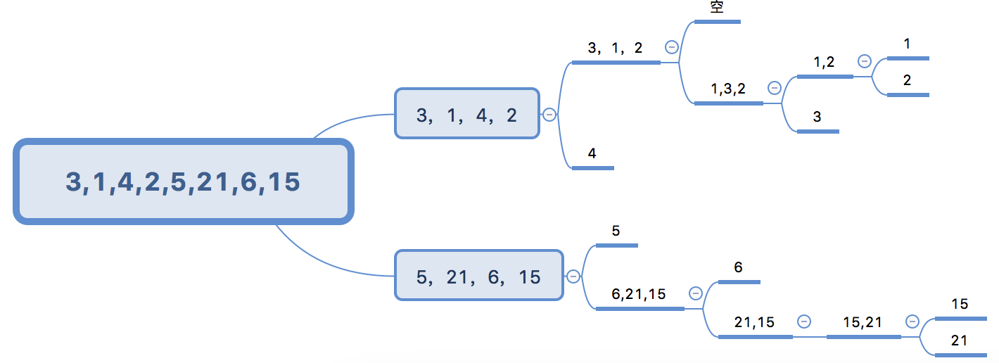

# 数组排序算法

[十大经典排序算法](https://cnblogs.com/onepixel/p/7674659.html)

- 冒泡排序
- 快速排序
- 插入排序

## 冒泡排序

```js
var arr = [12, 10, 13, 8, 4];
// target: [4,8,10,12,13] 从小到大排序
// 思想：当前项和后一项进行比较，如果当前项大于后一项，两者交换位置
/*
  第一轮比较四次，将最大的已经放到最后了，接下来下一轮，一共需要arr.length-1轮
  [10,12,13,8,4]
  [10,12,13,8,4]
  [10,12,8,13,4]
  [10,12,8,4,13]
  接下来第二轮比较三次

  i控制轮数，从0开始的话
  i=0第一轮 比较arr.length-1-0次
  i=1第一轮 比较arr.length-1-1次
  i=2第一轮 比较arr.length-1-2次
  ...
  i=n第n轮 比较arr.length-1-n次

  当当前项大于后一下交换位置
  var a = 12;
  var b = 13;
  var c = null;
  c = a;
  a = b;
  b = c
*/

function sortAry(ary) {
  // i代表轮数，比较ary.length-1次
  for (var i = 0; i < ary.length - 1; i++) {
    // 比较arr.length-1-i次，j代表每一轮比较的次数,不用和自己比，不用和上一轮最后一项的最大值比较
    for (var j = 0; j < ary.length - 1 - i; j++) {
      var cur = ary[j],
        next = ary[j + 1];
      if (cur > next) {
        // 如果当前项大于下一项，交换位置
        var temp = null;
        temp = ary[j];
        ary[j] = ary[j + 1];
        ary[j + 1] = temp;
      }
    }
  }
}
sortAry(arr);
console.log(arr);
```

## 优化冒泡排序

[文章链接](https://mp.weixin.qq.com/s/9dkKBV2qBiPHIBCvtnzb-Q)

```js
// 假设一种场景，比如 8 1 2 3 5 7，进行一次排序之后，结果就变成了 1 2 3 5 7 8，就没有必要继续循环下去了
// 优化的点主要在于：假如某一趟排序之后已经有序，我们需要减少排序的趟数。否则就做了很多无用功。
function sortAry(ary) {
  // i代表轮数，比较ary.length-1次
  for (var i = 0; i < ary.length - 1; i++) {
    var exchange = false;
    // 比较arr.length-1-i次，j代表每一轮比较的次数,不用和自己比，不用和上一轮最后一项的最大值比较
    for (var j = 0; j < ary.length - 1 - i; j++) {
      var cur = ary[j],
        next = ary[j + 1];
      if (cur > next) {
        // 如果当前项大于下一项，交换位置
        var temp = null;
        temp = ary[j];
        ary[j] = ary[j + 1];
        ary[j + 1] = temp;
        exchange = true;
      }
    }
    if (!exchange) {
      break;
    }
  }
}
```

## 双向冒泡

普通的冒泡排序在一趟循环中只能找出一个最大值或最小值，双向冒泡则是多一轮循环既找出最大值也找出最小值

```js
function bubbleSort_twoWays(nums) {
  let low = 0;
  let high = nums.length - 1;
  while (low < high) {
    let mark = true;
    // 找到最大值放到右边
    for (let i = low; i < high; i++) {
      if (nums[i] > nums[i + 1]) {
        [nums[i], nums[i + 1]] = [nums[i + 1], nums[i]];
        mark = false;
      }
    }
    high--;
    // 找到最小值放到左边
    for (let j = high; j > low; j--) {
      if (nums[j] < nums[j - 1]) {
        [nums[j], nums[j - 1]] = [nums[j - 1], nums[j]];
        mark = false;
      }
    }
    low++;
    if (mark) return;
  }
}
```

## 插入排序(INSERTION-SORT)

插入排序：对于少量元素比较有效。

```js
// 插入排序第一版
function sort(elements) {
  //假设第0个元素是一个有序的数列，第1个以后的是无序的序列，
  //所以从第1个元素开始将无序数列的元素插入到有序数列中
  for (var i = 1; i < elements.length; i++) {
    //升序
    if (elements[i] < elements[i - 1]) {
      //取出无序数列中的第i个作为被插入元素
      var guard = elements[i];
      //记住有序数列的最后一个位置，并且将有序数列位置扩大一个
      var j = i - 1;
      // elements[i] = elements[j]; // 我发现这句是多余的

      //比大小，找到被插入元素所在的位置
      while (j >= 0 && guard < elements[j]) {
        elements[j + 1] = elements[j];
        j--;
      }

      //插入
      elements[j + 1] = guard;
    }
  }
}

var elements = [10, 9, 8, 7, 6, 5];
console.log("before: " + elements);
sort(elements);
console.log(" after: " + elements);

// 插入排序第二版
function insertionSort(arr) {
  let len = arr.length;
  let j, temp;
  for (let i = 1; i < length; i++) {
    j = i;
    temp = arr[i];
    while (j > 0 && array[j - 1] > temp) {
      arr[j] = arr[j - 1];
      j--;
    }
    if (j !== i) {
      arr[j] = temp;
    }
  }
}
```

## 选择排序

选择排序大致的思路是找到数据结构中的最小值并将其放到第一位，接着找到第二小的值放到第二位。和冒泡排序相似，区别在于选择排序是将每一个元素和它后面的元素进行比较和交换

时间复杂度 O(n^2)

```js
function swap(arr, index1, index2) {
  let aux = arr[index1];
  arr[index1] = arr[index2];
  arr[index2] = aux;
}
function selectionSort(array) {
  let length = array.length;
  let indexMin; // 最小值的索引
  for (let i = 0; i < length - 1; i++) {
    indexMin = i;
    for (let j = i + 1; j < length; j++) {
      if (array[indexMin] > array[j]) {
        indexMin = j;
      }
    }
    if (i !== indexMin) {
      swap(array, i, indexMin);
    }
  }
}
let arr = [4, 8, 2];
selectionSort(arr);
console.log(arr);
```

```js
// 简写的选择排序，但是存在多次交换的问题
function selectSort(nums) {
  for (let i = 0, len = nums.length; i < len; i++) {
    for (let j = i + 1; j < len; j++) {
      if (nums[i] > nums[j]) {
        [nums[i], nums[j]] = [nums[j], nums[i]];
      }
    }
  }
}
```

## 归并排序

[图解排序算法(四)之归并排序](https://www.cnblogs.com/chengxiao/p/6194356.html)

最好：O(n _ logn)
最坏：O(n _ logn)
平均：O(n \* logn)

归并排序是一种分治算法。其思想是将原始的数组切分为较小的数组，直到每个小数组只有一个位置，接着将小数组归并成较大的数组，直到最后只有一个排序完毕的大数组。

```js
const Compare = {
  LESS_THAN: -1,
  BIGGER_THAN: 1,
  EQUALS: 0,
};
function defaultCompare(a, b) {
  if (a === b) {
    return Compare.EQUALS;
  }
  return a < b ? Compare.LESS_THAN : Compare.BIGGER_THAN;
}

// 归并函数
function merge(left, right, compareFn) {
  let i = 0;
  let j = 0;
  const result = [];
  while (i < left.length && j < right.length) {
    result.push(
      compareFn(left[i], right[j]) === Compare.LESS_THAN
        ? left[i++]
        : right[j++]
    );
  }
  return result.concat(i < left.length ? left.slice(i) : right.slice(j));
}
// 切分大数组
function mergeSort(array, compareFn = defaultCompare) {
  if (array.length > 1) {
    const { length } = array;
    const middle = Math.floor(length / 2);
    const left = mergeSort(array.slice(0, middle), compareFn);
    const right = mergeSort(array.slice(middle, length), compareFn);
    array = merge(left, right, compareFn);
  }
  return array;
}

// 上边的简写
// 归并函数，这个函数主要负责将传入的两个数组进行排序
function merge(left, right) {
  let i = 0; // i,j 为 left right 的左右两个指针
  let j = 0;
  const result = [];
  while (i < left.length && j < right.length) {
    // 将小的数依次插入到 result 中，同时移动左右指针，知道某个数组遍历完了，即某个数组的指针停到了数组结尾，但是总有一个数组是不会被遍历完的，即指针没有停到数组的结尾，那么剩下的就是大的数据了，所以在 return 处做了一次 concat
    result.push(left[i] < right[j] ? left[i++] : right[j++]);
  }
  return result.concat(i < left.length ? left.slice(i) : right.slice(j));
}
// 切分大数组
function mergeSort(array) {
  if (array.length > 1) {
    const { length } = array;
    const middle = Math.floor(length / 2);
    const left = mergeSort(array.slice(0, middle));
    const right = mergeSort(array.slice(middle, length));
    array = merge(left, right);
  }
  return array;
}

let arr = [4, 8, 2];
console.log(mergeSort(arr));
```

## 快速排序

快速排序也许是最常用的排序算法了。它的复杂度是 O(nlogn)，且它的性能通常比其他的复杂度为 O(nlogn) 的排序算法要好。

快速排序也是采用分治的方法，将原始数组分为较小的数组。

### 第一种快排

取中间数为基准，分别创建左右两个子数组，比基准小的放到左子数组，比基准大的放到右子数组，在分别对两个子数组进行相同操作

第一种快速排序。不太好， splice 性能较差，因为 splice 每次操作都会创建新的数组，空间复杂度较高。从数组的中间拿一个值，然后通过这个值挨个和数组里面的值进行比较，如果大于的放一边，小于的放一边，然后把这些合并，再进行比较，如此反复即可。

```js
var arr = [3, 1, 4, 2, 5, 21, 6, 15, 63];
function sortA(arr) {
  // 如果只有一位，就没有必要比较
  if (arr.length <= 1) {
    return arr;
  }
  // 获取中间值的索引
  var len = Math.floor(arr.length / 2);
  // 截取中间值
  var cur = arr.splice(len, 1);
  // 小于中间值放这里面
  var left = [];
  // 大于的放着里面
  var right = [];
  for (var i = 0; i < arr.length; i++) {
    // 判断是否大于
    if (cur > arr[i]) {
      left.push(arr[i]);
    } else {
      right.push(arr[i]);
    }
  }
  // 通过递归，上一轮比较好的数组合并，并且再次进行比较。
  console.log(sortA(left).concat(cur, sortA(right)));
  return sortA(left).concat(cur, sortA(right));
}
console.log(sortA(arr));
```

额，理解起来比较难，画了个图


### 第二种快排

第二种快速排序，和归并排序类似，也使用分治的方法，将原始数组分为较小的数组(但它没有像归并排序那样将它们分割开)。

- 首先，从数组中选择中间一项作为基准数
- 创建两个指针，左边一个指向数组第一项，右边一个指向数组最后一项。移动左指针直到我们找到一个比基准数大的元素，接着移动右指针直到找到一个比基准数素小的元素，然后交换它们，重复这个过程，直到左指针超过了右指针。这个过程将使得比基准数小的值都排在基准数之前，而比基准数大的元素都排在基准数之后。这一步叫作划分操作
- 接着，算法对划分后的小数组(较基准数小的值组成的子数组，以及较基准数大的值组成的子数组)重复之前的两个步骤，直至数组已完全排序

```js
function swap(array, a, b) {
  /* const temp = array[a];
  array[a] = array[b];
  array[b] = temp; */
  [array[a], array[b]] = [array[b], array[a]];
}

function partition(array, left, right) {
  const pivot = array[Math.floor((right + left) / 2)]; // 取中间值
  let i = left;
  let j = right;

  while (i <= j) {
    while (array[i] < pivot) {
      i++; // 如果左边的指针的值小于中间值，符合条件，移动左指针，最多移动到中间的这个值的位置
    }
    while (array[j] > pivot) {
      j--; // 如果右边的指针的值大于中间值，符合条件，移动右指针，最多移动到中间的这个值的位置
    }
    if (i <= j) {
      // 如果 i <= j 说明在上边的两个 while 循环中某个地方停住了，交换位置，同时移动指针
      swap(array, i, j);
      i++;
      j--;
    }
  }
  return i;
}
function quick(array, left, right) {
  let index;
  if (array.length > 1) {
    index = partition(array, left, right);
    if (left < index - 1) {
      // 停止递归的条件，符合条件继续对左边部分进行排序
      quick(array, left, index - 1);
    }
    if (index < right) {
      // 停止递归的条件，符合条件继续对左边部分进行排序
      quick(array, index, right);
    }
  }
  return array;
}
export function quickSort(array) {
  return quick(array, 0, array.length - 1);
}
```

### 第三中快排

[以左边第一个数为基准](https://wiki.jikexueyuan.com/project/easy-learn-algorithm/fast-sort.html)

从左右两边向中间推进的时候，遇到不符合的数就两边交换值。同上边文章链接思想

```js
function quickSort1(nums) {
  function recursive(arr, left, right) {
    if (left >= right) return;
    let index = partition(arr, left, right);
    recursive(arr, left, index - 1);
    recursive(arr, index + 1, right);
    return arr;
  }
  function partition(arr, left, right) {
    let temp = arr[left];
    let p = left + 1;
    let q = right;
    while (p <= q) {
      while (p <= q && arr[p] < temp) p++;
      while (p <= q && arr[q] > temp) q--;
      if (p <= q) {
        [arr[p], arr[q]] = [arr[q], arr[p]];
        // 交换值后两边各向中间推进一位
        p++;
        q--;
      }
    }
    // 修改基数的位置
    [arr[left], arr[q]] = [arr[q], arr[left]];
    return q;
  }
  recursive(nums, 0, nums.length - 1);
}
```

从右边向中间推进的时候，遇到小于基数的数就赋给左边（一开始是基数的位置），右边保留原先的值等之后被左边的值填上。算是上边的一个变种

```js
function quickSort(nums) {
  // 递归排序基数左右两边的序列
  function recursive(arr, left, right) {
    if (left >= right) return;
    let index = partition(arr, left, right);
    recursive(arr, left, index - 1);
    recursive(arr, index + 1, right);
    return arr;
  }
  // 将小于基数的数放到基数左边，大于基数的数放到基数右边，并返回基数的位置
  function partition(arr, left, right) {
    // 取第一个数为基数
    let temp = arr[left];
    while (left < right) {
      while (left < right && arr[right] >= temp) right--;
      arr[left] = arr[right];
      while (left < right && arr[left] < temp) left++;
      arr[right] = arr[left];
    }
    // 修改基数的位置
    arr[left] = temp;
    return left;
  }
  recursive(nums, 0, nums.length - 1);
}
```

## 堆排序

[图解排序算法(三)之堆排序](https://www.cnblogs.com/chengxiao/p/6129630.html)

```js
function heapSort(nums) {
  // 调整最大堆，使index的值大于左右节点
  function adjustHeap(nums, index, size) {
    // 交换后可能会破坏堆结构，需要循环使得每一个父节点都大于左右结点
    while (true) {
      let max = index;
      let left = index * 2 + 1; // 左节点
      let right = index * 2 + 2; // 右节点
      if (left < size && nums[max] < nums[left]) max = left;
      if (right < size && nums[max] < nums[right]) max = right;
      // 如果左右结点大于当前的结点则交换，并再循环一遍判断交换后的左右结点位置是否破坏了堆结构（比左右结点小了）
      if (index !== max) {
        [nums[index], nums[max]] = [nums[max], nums[index]];
        index = max;
      } else {
        break;
      }
    }
  }
  // 建立最大堆
  function buildHeap(nums) {
    // 注意这里的头节点是从0开始的，所以最后一个非叶子结点是 parseInt(nums.length/2)-1
    let start = parseInt(nums.length / 2) - 1;
    let size = nums.length;
    // 从最后一个非叶子结点开始调整，直至堆顶。
    for (let i = start; i >= 0; i--) {
      adjustHeap(nums, i, size);
    }
  }

  buildHeap(nums);
  // 循环n-1次，每次循环后交换堆顶元素和堆底元素并重新调整堆结构
  for (let i = nums.length - 1; i > 0; i--) {
    [nums[i], nums[0]] = [nums[0], nums[i]];
    adjustHeap(nums, 0, i);
  }
}
```

堆排序也是一种很高效的算法，因其把数组当作二叉树来排序而得名。这个算法会根据以下信息，把数组当作二叉树来管理。

- 索引 0 是树的根节点
- 除根节点外，任意节点 N 的父节点是 N/2
- 节点 L 的左子节点是 2\*L
- 节点 R 的右子节点是 2\*R + 1

```js
function defaultCompare(a, b) {
  if (a === b) {
    return Compare.EQUALS;
  }
  return a < b ? Compare.LESS_THAN : Compare.BIGGER_THAN;
}

function swap(array, a, b) {
  /* const temp = array[a];
  array[a] = array[b];
  array[b] = temp; */
  [array[a], array[b]] = [array[b], array[a]];
}

function heapify(array, index, heapSize, compareFn) {
  let largest = index;
  const left = 2 * index + 1;
  const right = 2 * index + 2;
  if (left < heapSize && compareFn(array[left], array[index]) > 0) {
    largest = left;
  }
  if (right < heapSize && compareFn(array[right], array[largest]) > 0) {
    largest = right;
  }
  if (largest !== index) {
    swap(array, index, largest);
    heapify(array, largest, heapSize, compareFn);
  }
}

function buildMaxHeap(array, compareFn) {
  for (let i = Math.floor(array.length / 2); i >= 0; i -= 1) {
    heapify(array, i, array.length, compareFn);
  }
  return array;
}

// 堆排序算法
function heapSort(array, compareFn = defaultCompare) {
  let heapSize = array.length;
  buildMaxHeap(array, compareFn); // 第一步 构建一个满足 array[parent(i)] >= array[i] 的堆结构
  while (heapSize > 1) {
    swap(array, 0, --heapSize); // 第二步 交换堆里第一个元素(数组中较大的值)和最后一个元素的位置。这样，最大的值就会出现在它已排序的位置
    heapify(array, 0, heapSize, compareFn); // 第二步可能会丢掉堆的属性，因此，需要执行一个 heapify 的函数，再次将数组转换成堆，也就是说，它会找到当前的根节点(较小的值)，重新放回到树的底部
  }
  return array;
}
```

## 分布式排序

分布式排序算法：原始数组中的数据会分发到多个中间结构(桶)，在合起来放回原始数组。

最著名的分布式算法有计数排序、桶排序和基数排序。这三种算法非常相似。

### 计数排序

以数组元素值为键，出现次数为值存进一个临时数组，最后再遍历这个临时数组还原回原数组。因为 JavaScript 的数组下标是以字符串形式存储的，所以计数排序可以用来排列负数，但不可以排列小数。

最好：O(n + k)，k 是最大值和最小值的差。
最坏：O(n + k)
平均：O(n + k)

```js
// 找到数组中最大的值
function findMaxValue(array) {
  if (array && array.length > 0) {
    let max = array[0];
    for (let i = 1; i < array.length; i++) {
      if (max < array[i]) {
        max = array[i];
      }
    }
    return max;
  }
  return undefined;
}
// 计数排序
function countingSort(array) {
  if (array.length < 2) {
    return array;
  }
  const maxValue = findMaxValue(array); // 找到原有数组中最大的值
  let sortedIndex = 0;
  const counts = new Array(maxValue + 1); // 根据最大值生成一个数组
  array.forEach((element) => {
    if (!counts[element]) {
      counts[element] = 0;
    }
    counts[element]++;
  });
  // console.log('Frequencies: ' + counts.join()); // Frequencies: ,1,,1,,,1 注意这里，相当于将原有数组按大小排到一起，比如原有数组中有一个1，则 counts 在 1 的位置记 1，如果有两个就计2。例如 counts 位 [, 3, , 1] 说明原数组中包含： [1, 1, 1, 3]
  counts.forEach((element, i) => {
    // 遍历 counts，此时的 counts 已经记录了数组中各个值的数量，只要根据每个数值的数量依次插入到 array 中就完成排序
    while (element > 0) {
      array[sortedIndex++] = i;
      element--;
    }
  });
  return array;
}

console.log(countingSort([1, 6, 3]));
```

```js
// 同上
function countingSort(nums) {
  let arr = [];
  let max = Math.max(...nums);
  let min = Math.min(...nums);
  // 装桶
  for (let i = 0, len = nums.length; i < len; i++) {
    let temp = nums[i];
    arr[temp] = arr[temp] + 1 || 1;
  }
  let index = 0;
  // 还原原数组
  for (let i = min; i <= max; i++) {
    while (arr[i] > 0) {
      nums[index++] = i;
      arr[i]--;
    }
  }
}
```

**计数排序优化**

把每一个数组元素都加上 min 的相反数，来避免特殊情况下的空间浪费，通过这种优化可以把所开的空间大小从 max+1 降低为 max-min+1，max 和 min 分别为数组中的最大值和最小值。

比如数组 [103, 102, 101, 100]，普通的计数排序需要开一个长度为 104 的数组，而且前面 100 个值都是 undefined，使用该优化方法后可以只开一个长度为 4 的数组。

```js
function countingSort(nums) {
  let arr = [];
  let max = Math.max(...nums);
  let min = Math.min(...nums);
  // 加上最小值的相反数来缩小数组范围
  let add = -min;
  for (let i = 0, len = nums.length; i < len; i++) {
    let temp = nums[i];
    temp += add;
    arr[temp] = arr[temp] + 1 || 1;
  }
  let index = 0;
  for (let i = min; i <= max; i++) {
    let temp = arr[i + add];
    while (temp > 0) {
      nums[index++] = i;
      temp--;
    }
  }
}
```

### 捅排序

- [最简单的桶排序](http://wiki.jikexueyuan.com/project/easy-learn-algorithm/bucket-sort.html)
- [拜托，面试别再问我桶排序了](http://zhuanlan.51cto.com/art/201811/586129.htm)

```js
function bucketSort(nums) {
  // 桶的个数，只要是正数即可
  let num = 5;
  let max = Math.max(...nums);
  let min = Math.min(...nums);
  // 计算每个桶存放的数值范围，至少为1，
  let range = Math.ceil((max - min) / num) || 1;
  // 创建二维数组，第一维表示第几个桶，第二维表示该桶里存放的数
  // let arr = Array.from(Array(num)).map(() => Array().fill(0));
  let arr = Array(num).fill([]);
  nums.forEach((val) => {
    // 计算元素应该分布在哪个桶
    let index = parseInt((val - min) / range);
    // 防止index越界，例如当[5,1,1,2,0,0]时index会出现5
    index = index >= num ? num - 1 : index;
    let temp = arr[index];
    // 插入排序，将元素有序插入到桶中
    let j = temp.length - 1;
    while (j >= 0 && val < temp[j]) {
      temp[j + 1] = temp[j];
      j--;
    }
    temp[j + 1] = val;
  });
  // 修改回原数组
  let res = [].concat.apply([], arr);
  nums.forEach((val, i) => {
    nums[i] = res[i];
  });
}
```

### 基数排序

- [基数排序](https://www.cnblogs.com/sun/archive/2008/06/26/1230095.html)

使用十个桶 0-9，把每个数从低位到高位根据位数放到相应的桶里，以此循环最大值的位数次。但只能排列正整数，因为遇到负号和小数点无法进行比较。

最好：O(n _ k)，k 表示最大值的位数。
最坏：O(n _ k)
平均：O(n \* k)

```js
function radixSort(nums) {
  // 计算位数
  function getDigits(n) {
    let sum = 0;
    while (n) {
      sum++;
      n = parseInt(n / 10);
    }
    return sum;
  }
  // 第一维表示位数即0-9，第二维表示里面存放的值
  let arr = Array.from(Array(10)).map(() => Array());
  let max = Math.max(...nums);
  let maxDigits = getDigits(max);
  for (let i = 0, len = nums.length; i < len; i++) {
    // 用0把每一个数都填充成相同的位数
    nums[i] = (nums[i] + "").padStart(maxDigits, 0);
    // 先根据个位数把每一个数放到相应的桶里
    let temp = nums[i][nums[i].length - 1];
    arr[temp].push(nums[i]);
  }
  // 循环判断每个位数
  for (let i = maxDigits - 2; i >= 0; i--) {
    // 循环每一个桶
    for (let j = 0; j <= 9; j++) {
      let temp = arr[j];
      let len = temp.length;
      // 根据当前的位数i把桶里的数放到相应的桶里
      while (len--) {
        let str = temp[0];
        temp.shift();
        arr[str[i]].push(str);
      }
    }
  }
  // 修改回原数组
  let res = [].concat.apply([], arr);
  nums.forEach((val, index) => {
    nums[index] = +res[index];
  });
}
```

## 希尔排序

[参考文章](https://www.cnblogs.com/chengxiao/p/6104371.html)

通过某个增量 gap，将整个序列分给若干组，从后往前进行组内成员的比较和交换，随后逐步缩小增量至 1。希尔排序类似于插入排序，只是一开始向前移动的步数从 1 变成了 gap。

最好：O(n _ logn)，步长不断二分。
最坏：O(n _ logn)
平均：O(n \* logn)

```js
function shellSort(array) {
  let increment = Math.floor(array.length / 2);
  while (increment > 0) {
    for (let i = increment; i < array.length; i++) {
      let j = i;
      const temp = array[i];
      // 小型的插入排序
      while (j >= increment && array[j - increment] > temp) {
        array[j] = array[j - increment];
        j -= increment;
      }
      array[j] = temp;
    }
    // 缩小gap
    // increment = parseInt(increment / 2) // 也可以简单的每次缩小一半
    if (increment === 2) {
      increment = 1;
    } else {
      increment = Math.floor((increment * 5) / 11);
    }
  }
  return array;
}
```
