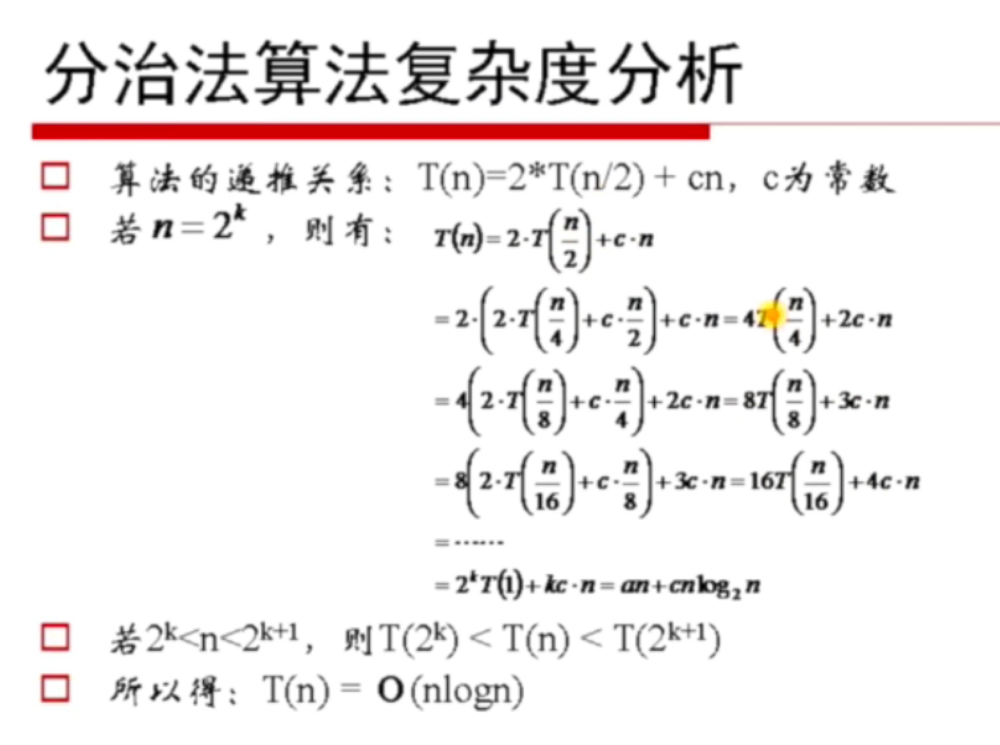

# 最大子序和

[最大子序和-Array-简单](https://leetcode-cn.com/problems/maximum-subarray/)


```
给定一个整数数组 nums ，找到一个具有最大和的连续子数组（子数组最少包含一个元素），返回其最大和。

示例:

输入: [-2,1,-3,4,-1,2,1,-5,4],
输出: 6
解释: 连续子数组 [4,-1,2,1] 的和最大，为 6。
进阶:

如果你已经实现复杂度为 O(n) 的解法，尝试使用更为精妙的分治法求解。
```

## 方法1: 暴力法

```js
/**
 * 方法1 暴力法
 * 直接求解 A[i, ...j] 的和
 * 0 <= i < n
 * i <= j < n
 * 时间复杂度 O(n^3)
 */

function maxSubArray(arr) {
  let len = arr.length
  let maxSum = arr[0]
  let currSum
  let pos = [0, 0]
  for (var i = 0; i < len; i++) {
    for (var j = i; j < len; j++) {
      currSum = 0
      for (var k = i; k <= j; k++) {
        currSum += arr[k]
      }
      if (currSum > maxSum) {
        pos = [i, j]
        maxSum = currSum
      }
    }
  }
  console.log(pos) // 开始结束位置
  return maxSum
}

var arr = [-2, 1, -3, 4, -1, 2, 1, -5, 4]
console.log(maxSubArray(arr))
```

## 方法2: 分治法

```js
/**
 * 方法2 分治法
 * 将数组重中间分开，那么最大子数组要么完全在左半边数组，要么完全在右半边数组，要么跨立在分界点上
 * 完全在左数组、右数组递归解决
 * 跨立在分界点上：实际上是左数组的最大后缀和右数组的最大前缀的和。因此从分界点向前扫，向后扫即可
 * 时间复杂度 O(nlogn)
 */

function maxAddSub(arr, from, to) {
  if (from === to) {
    return arr[from]
  }
  let middle = Math.floor((from + to) / 2)
  let m1 = maxAddSub(arr, from, middle)
  let m2 = maxAddSub(arr, middle + 1, to)

  let i
  let left = arr[middle]
  let now = arr[middle]
  for (let i = middle - 1; i >= from; i--) {
    now += arr[i]
    left = Math.max(now, left)
  }
  let right = arr[middle + 1]
  now = arr[middle + 1]
  for (let i = middle + 2; i <= to; i++) {
    now += arr[i]
    right = Math.max(now, right)
  }

  let m3 = left + right
  return Math.max(m1, m2, m3)
}

var arr = [-2, 1, -3, 4, -1, 2, 1, -5, 4]
console.log(maxAddSub(arr, 0,  arr.length - 1))
```

分治法时间复杂度



## 方法3: 分析法(逻辑推理的算法应用)

```js
/**
 * 分析法(逻辑推理的算法应用)
 * 前缀和 p[i] = a[0] + a[1] + ... + a[i]
 * s[i, j] = p[j] - p[i - 1](定义p[-1] = 0)
 * 算法过程
 * 1. 求 i 前缀 p[i]:
 *    遍历i: 0 <= i <= n - 1
 *    p[i] = p[i - 1] + A[i]
 * 2. 计算 p[i] - p[j]
 *    遍历i: 0 <= i <= n-1 ，求最小值 m
 *    m 的初始值取0(p[-1]=0)，然后遍历 p[0, ..., i-1] 更新m
 *    p[i] - m 即为以 a[i] 结尾的数组中最大的子数组
 * 3. 在第2步中，可顺手记录 p[i] - m 的最大值
 *    为什么
 * 时间复杂度 O(n)
 *
 * 进一步分析：
 * 记 S[i] 为以 A[i] 结尾的数组中和最大的子数组
 * 则 S[i + 1] = max(S[i] + A[i + 1], A[i + 1])
 * S[0] = A[0]
 * 遍历i: 0 <= i <= n-1
 * 动态规划: 最优子问题
 * 时间复杂度: O(n)
 */

function maxSub(a) {
  var result = a[0]
  var sum = a[0]
  var pos = [0, 0]
  for (let i = 1; i < arr.length; i++) {
    if (sum > 0) {
      sum += a[i]
    } else {
      sum = a[i]
      pos[0] = i // 和最大子数组的 开头的肯定是正数(如果都为负数，那就是当前遍历的负数)，而且往后在加 sum 肯定也是正的
    }
    if (sum > result) {
      result = sum
      pos[1] = i
    }
  }
  console.log(pos)
  return result
}

var arr = [-2, 1, -3, 4, -1, 2, 1, -5, 4]
console.log(maxSub(arr))
```
