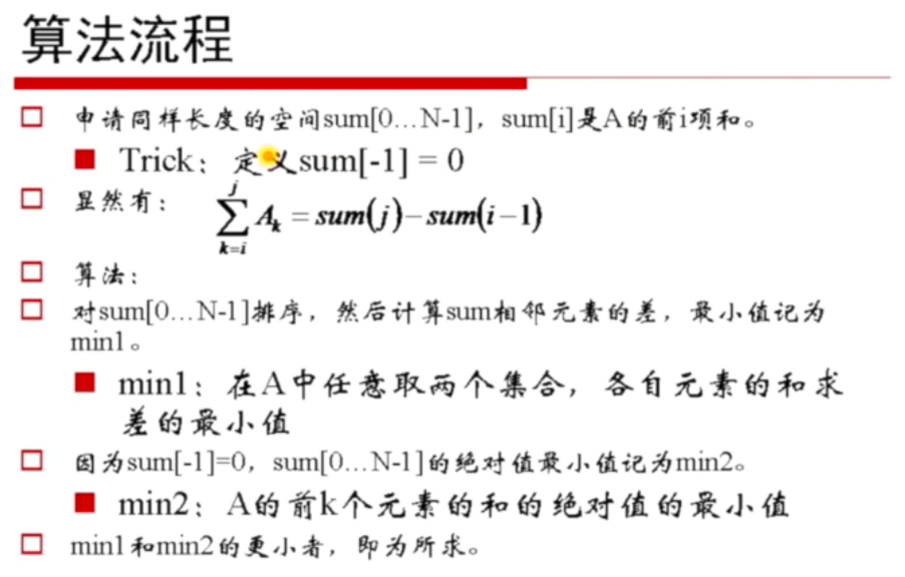
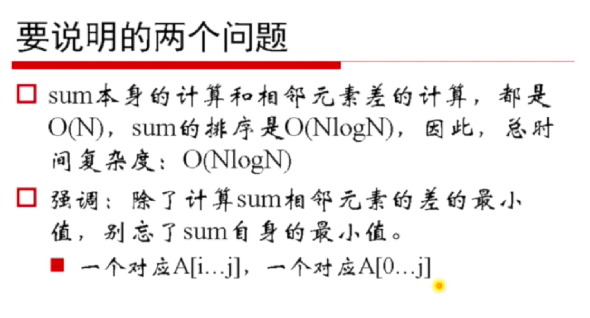

# 零子数组




```
求对于长度为N的数组A，求子数组的和接近0的子数组的和的值，要求时间复杂度O(NlogN)
```

## 方法1

```js
/**
 * 在leetcode上没找到原题
 */

function MinSubArray(arr) {
  var sum = []
  sum[0] = 0
  for (let i = 0; i < arr.length; i++) {
    sum[i + 1] = sum[i] + arr[i]
  }
  sum.sort((a, b) => a - b)
  var difference = Math.abs(sum[1] - sum[0])
  var result = difference
  for (let i = 1; i < arr.length; i++) {
    difference = Math.abs(sum[i + 1] - sum[i])
    result = Math.min(difference, result)
  }
  return result
}

console.log(MinSubArray([1, 4, 8, -4, -2]))
console.log(MinSubArray([1, 4, -4, -2]))
```
