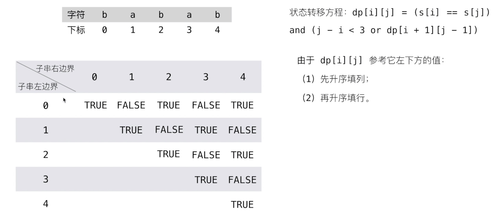

# 最长回文子串-中等

[最长回文子串-中等](https://leetcode-cn.com/problems/longest-palindromic-substring/)

```
给定一个字符串 s，找到 s 中最长的回文子串。你可以假设 s 的最大长度为 1000。

示例 1：

输入: "babad"
输出: "bab"
注意: "aba" 也是一个有效答案。

示例 2：

输入: "cbbd"
输出: "bb"
```




[参考文章](https://leetcode-cn.com/problems/longest-palindromic-substring/solution/zui-chang-hui-wen-zi-chuan-by-leetcode-solution/)

## 方法1: 暴力解法

```js
// 时间复杂度 O(n^3)
// 空间复杂度 O(1)
function longestPalindromicSubstring(s) {
  let len = s.length
  if (len < 2) {
    return s
  }
  let maxLen = 1
  let begin = 0
  let charArray = s.split('')

  for (let i = 0; i < len - 1; i++) {
    for (let j = i + 1; j < len; j++) {
      if (j - i + 1 > maxLen && validPalindromic(charArray, i, j)) {
        maxLen = j - i + 1
        begin = i
      }
    }
  }
  return s.substring(begin, begin + maxLen)
}
function validPalindromic(charArray, left, right) {
  while (left < right) {
    if (charArray[left] != charArray[right]) {
      return false
    }
    left++
    right--
  }
  return true
}
```

## 方法2: 中心扩散法

```js
// 枚举所有可能的回文子串的中心位置，中心位置可能是一个字符，也有可能是两个相邻的字符，记录最长回文子串的相关变量
// 时间复杂度：O(n^2)
// 空间复杂度 O(1)
function longestPalindromicSubstring(s) {
  let len = s.length
  if (len < 2) {
    return s
  }

  let maxLen = 1
  let begin = 0
  let charArray = s.split('')

  for (let i = 0; i < len - 1; i++) {
    let oddLen = expandAroundCenter(charArray, i, i)
    let evenLen = expandAroundCenter(charArray, i, i + 1)

    let curMaxLen = Math.max(oddLen, evenLen)

    if (curMaxLen > maxLen) {
      maxLen = curMaxLen
      begin = i - Math.floor((maxLen - 1) / 2)
    }
  }

  return s.substring(begin, begin + maxLen)
}

function expandAroundCenter(charArray, left, right) {
  // 当 left = right 的时候，回文中心是一个字符，回文串的长度是奇数
  // 当 left != right 的时候，回文中心是两个字符，回文串的长度是偶数
  let len = charArray.length
  let i = left
  let j = right
  while (i >= 0 && j < len) {
    if (charArray[i] === charArray[j]) {
      i--
      j++
    } else {
      break
    }
  }
  // j - i + 1 - 2
  return j - i - 1
}
```

## 方法3: 动态规划

```js
// 状态: dp[i][j] 表示子串 s[i..j] 是否为回文子串
// 得到状态转移方程：dp[i][j] = (s[i] == s[j]) and dp[i + 1][j - 1]
  // 边界条件：j - 1 - (i + 1) + 1 < 2，整理得 j - i < 3
// 初始化：dp[i][i] = true
// 输出：在得到一个状态得值为 true 的时候，记录起始位置和长度，填表完成后在截取
// 时间复杂度 O(n^2)
// 空间复杂度 O(n^2)
// 动态规划枚举的子串个数：O(n^2) 是暴力解法的优化
// 中心扩散法枚举的子串个数O(2n) = O(n)
function longestPalindromicSubstring(s) {
  let len = s.length
  if (len < 2) {
    return s
  }
  let maxLen = 1
  let begin = 0
  // 初始化一个二维dp数组
  // let dp = new Array(len).fill(new Array(len).fill(false)) // 这样有问题， fill 一个数组，导致引用传递
  let dp = new Array(len)
  for (let i = 0; i < len; i++) {
    dp[i] = new Array(len).fill(false) // 生成二维数组
    dp[i][i] = true
  }

  let charArray = s.split('')

  for (let j = 1; j < len; j++) {
    for (let i = 0; i < j; i++) {
      if (charArray[i] !== charArray[j]) {
        dp[i][j] = false
      } else {
        if (j - i < 3) {
          dp[i][j] = true
        } else {
          dp[i][j] = dp[i + 1][j - 1] || false // 参考左下角
        }
        if (dp[i][j] && j - i + 1 > maxLen) {
          maxLen = j - i + 1
          begin = i
        }
      }
    }
  }
  return s.substring(begin, begin + maxLen)
}
```

## 方法4: Manacher算法(马拉车算法)

暂时跳过

```js
// 专门用于查找最长回文子串的算法，将时间复杂度降到 O(n) 非常复杂
// function longestPalindromicSubstring (s) {
// }

console.log(longestPalindromicSubstring('babad'))
console.log(longestPalindromicSubstring('cbbd'))
console.log(longestPalindromicSubstring('abcba'))
```
