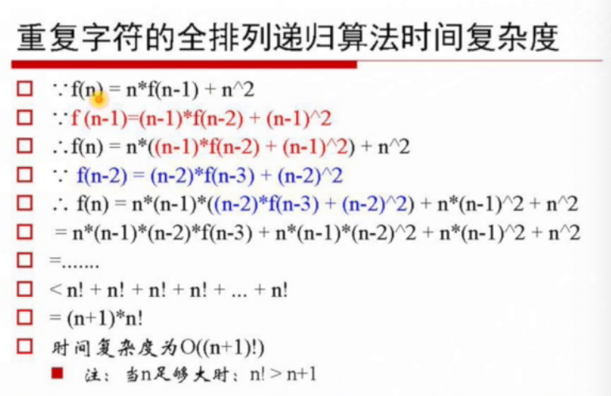

# 字符串的全排列



```
给定字符串S[0, ...N-1]，设计算法，枚举A的全排列

1. 使用递归解决问题
复杂度分析：
时间复杂度： O((n+1)!)
优化后： O(n!)

2. 不使用递归算法
```

## 方法1: 递归

```js
// 使用递归方式解决问题的思路
// 这里使用数组代替字符串了，字符串得重新赋值比较烦
// 以字符串1234为例：
// 1-234 第一次 i = 0，以1打头进行全排列，完事后交换回来
// 2-134 第二次 i = 1，以2打头进行全排列，完事后交换回来
// 3-124
// 4-231
// 递归，每次拿出来一位固定，剩余更小的单位在进行递归
// 如何保证不遗漏
//   保证递归前1234的顺序不变
var str = [1, 2, 2, 4]

/**
 * 假设字符串没有重复
 */
function Permutation(from, to) {
  if (from === to) {
    console.log(str) // 输出全排列结果
    return
  }
  for (let i = from; i <= to; i++) {
    swap(i, from)
    Permutation(from + 1, to)
    swap(i, from) // 回到开始状态
  }
}

function swap(m, n) {
  var x = str[m]
  str[m] = str[n]
  str[n] = x
}
// Permutation(0, str.length - 1)
```

## 方法2: 优化方法1

```js
/**
 * 如果字符串有重复，比如 [1, 2, 2, 3]
 * 1-223 以1打头
 * 2-123 以2打头，其中重复的2不再进行打头处理
 * 3-221 以3打头
 * 带重复字符的全排列就是每个字符分别与它后面非重复出现的字符交换
 * 即：第i个字符与第j个字符交换时，要求 [i, j] 中没有与第j个字符相等的数
 */

// 有重复字符的代码，仅增加了一个非重判断
function Permutation2(from, to) {
  if (from === to) {
    console.log(str) // 输出全排列结果
    return
  }
  for (let i = from; i <= to; i++) {
    if (!canSwap(from, i)) {
      continue;
    }
    swap(i, from)
    Permutation(from + 1, to)
    swap(i, from) // 回到开始状态
  }
}

function canSwap(from, to) {
  var can = true
  // 注意这里的循环，如果 from === to 则不会进入循环体内了，返回 true
  for (let i = from; i < to; i++) {
    if (str[i] === str[to]) {
      can = false
      break
    }
  }
  return can
}
// Permutation2(0, str.length - 1)
```

## 方法3: 继续优化

```js
/**
 * 继续优化，Permutation2中 canSwap 的操作可以通过一个变量记录
 * 空间换时间 时间复杂度从 O((n+1)!) 降到了 O(n!)
 */

function Permutation3(from, to) {
  if (from === to) {
    console.log(str) // 输出全排列结果
    return
  }
  let mark = {}
  for (let i = from; i <= to; i++) {
    if (mark[str[i]] === 1) {
      // i 这个字符 在本轮内 已经拿到过最前边了
      continue;
    }
    mark[str[i]] = 1
    swap(i, from)
    Permutation(from + 1, to)
    swap(i, from) // 回到开始状态
  }
}
Permutation3(0, str.length - 1)
```

## 方法4: 全排列的非递归算法

暂未实现
