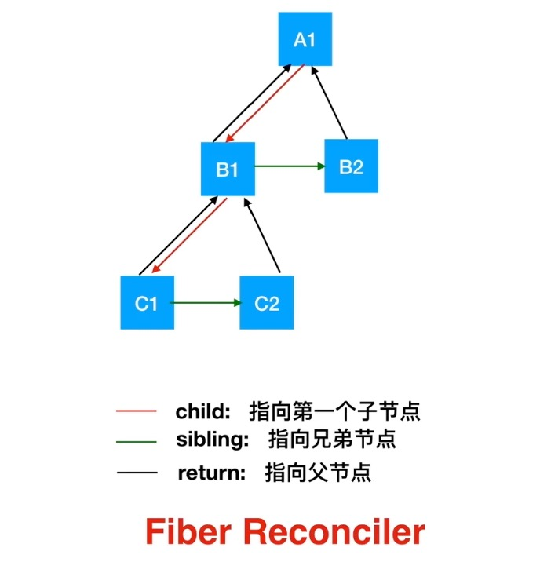
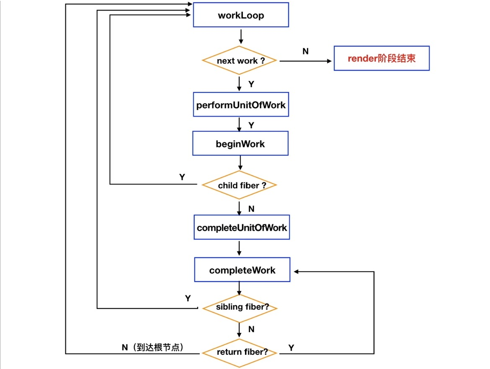
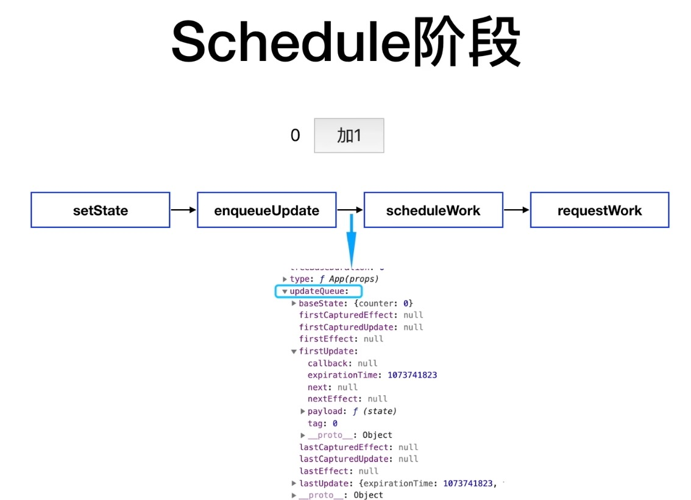
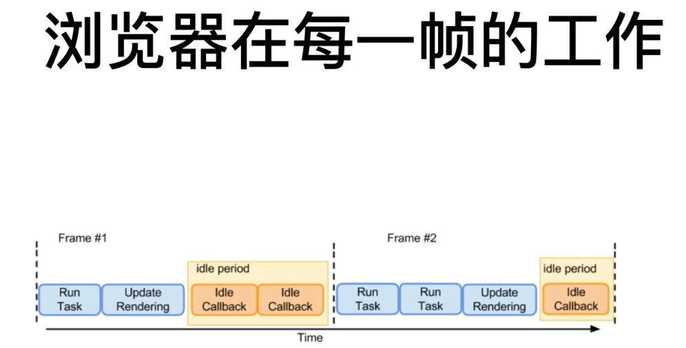

# fiber

- react 16的调和(reconciliation)引擎
- 关键特性：时间分片(time slicing)和暂停(suspense)

## fiber 是一种数据结构

- 暂停当前的工作任务，兵稍后返回继续
- 分配不同的优先级给不同的任务
- 复用任务
- 丢弃/终止任务

react fiber 设计前，基于 stack reconciler(栈式调和器)，递归调用渲染，调用栈会随着组件层级变深，无法暂停

react 16后将 stack reconciler 改为 fiber reconciler，链式结构

- child: 指向第一个子节点
- sibling: 指向兄弟节点
- return: 指向父节点

遍历方式：while 循环深度优先遍历方式，调用栈不会暴增

## fiber 工作流程

react 调和过程中，会保存 current & workInProgress 两颗 fiber 树。

- current tree: 反映当前屏幕上的 UI。hostRoot.current
- workInProgress tree: 反映将要变化的UI，current.alternate
- 两颗树上对应的 fiber node 通过 alternate 属性，互相引用

### Effect

- effect定义了 fiber node 在 commit 阶段要做的事情
- 对于组件，例如更新组件refs，调用 componentDidMount、componentDidUpdate 等
- 对于 dom 节点，例如 dom 的增加、删除、更新等
- fiber node节点上的字段名：effectTag

effects list: 由 effects 组成的链表

## react基本工作流程

schedule -> reconciliation/render -> commit -> browser screen

- schedule阶段
  - setState -> enqueueUpdate -> scheduleWork -> requestWork
  - 将更新放入队列，优先级设置，进入调和过程
- render阶段
  - beginWork: 根据 fiber node 的 tag，将逻辑代理到对应的函数处理，例如tag为 ClassComponent，由 updateClassComponent 处理
  - updateXXX: 如 updateClassComponent，借助组件实例，执行如下操作：
    1. UNSAFE_componentWillReceiveProps
    2. 执行 updateQueue 中的更新，计算新 state
    3. getDevicedStateUpdate
    4. shouldComponentUpdate
    5. UNSAFE_componentWillUpdate
    6. 增加一个 effect(componentDidUpdate)
    7. 更新组件实例的 state 和 props
    8. render(reconcile children)
- commit 阶段：是effects list生效，同步执行，不能打断(保证UI渲染一次完成)
  - commitBeforeMutationLifeCycles: getSnapshotBeforeUpdate
  - commitAllHostEffects: 更新dom
  - commitAllLifeCycles: componentDidUpdate/componentDidMount

## 并行渲染(concurrent rendering)

- [React 之 requestIdleCallback 来了解一下](https://juejin.cn/post/7166547963517337614)
- [React 之从 requestIdleCallback 到时间切片](https://juejin.cn/post/7167335700424196127)

当前 react 并没有使用原生 requestIdleCallback，但是借鉴了理念，当前通过 polyfill 自己模拟了一套

### 优先级

通过 expirationTime 确定优先级，优先级体现在3个维度上：

- HostRoot: 每一颗 fiber tree 的根节点(可能有多个 HostRoot)
- Fiber Node
- update queue

flushSync: 强制同步更新，优先级高
