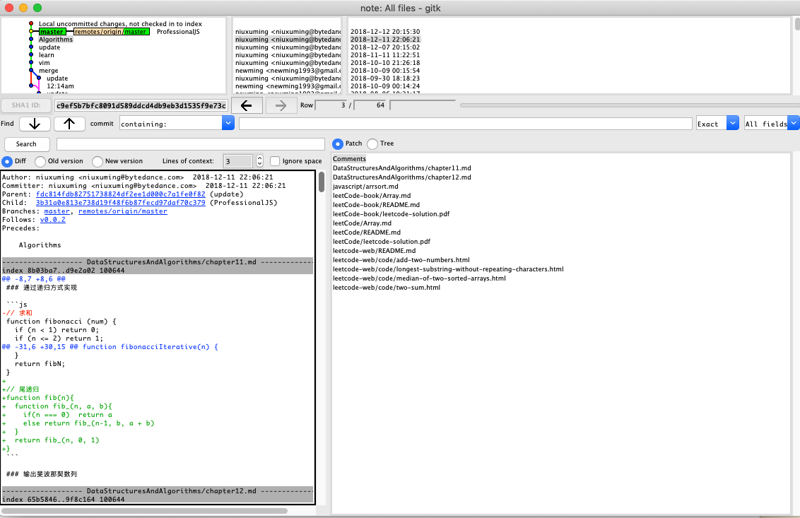
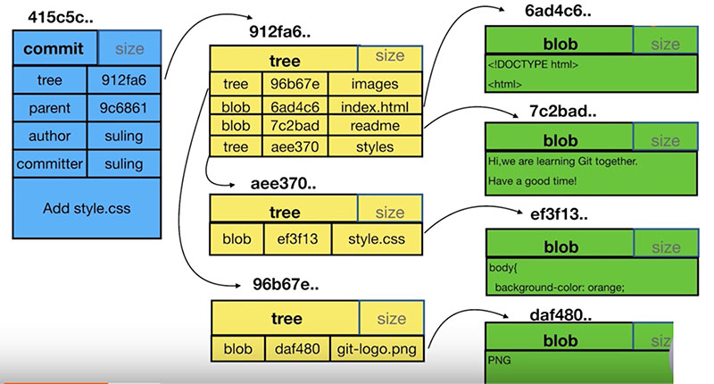

# git

VCS: version control system

- [Git 官网](https://git-scm.com)
- [GitHub](https://github.com)
- [GitLab](https://about.gitlab.com)
- [SVN](https://subversion.apache.org)

## 版本管理的演变

- VCS出现前： 用目录拷贝区别不同版本，公用文件容易被覆盖，成员沟通成本很高，代码集成效率低下
- 集中式VCS: (SVN)有集中的版本管理服务器，具备文件版本管理和分支管理能力，集成效率明显提高，客户端必须时刻和服务器相连
- 分布式VCS: (git)服务端和客户端都有完整的版本库，脱离服务端，客户端照样可以管理版本，查看历史和版本比较等多数操作，都不需要访问服务器，比集中式VCS更能提高版本管理效率

## Git 的特点

- 最优的存储能力
- 非凡的性能
- 开源的
- 很容易做备份
- 支持离线操作
- 很容易定制工作流程

## 设置用户

```bash
git config --local # 只对某个仓库有效，缺省等同于 local
git config --local user.name # 查看本地 user.name 信息
git config --local user.name newming # 设置本地 user.name 信息
git config --global # global对当前用户所有仓库有效
git config --system # system 对系统所有登陆的用户有效

# --list 查看全部配置
```

## add

```bash
git add -u # update 将已经跟踪了的文件，只是做了更新的文件添加到暂存区
```

## 重命名

```bash
# 常规删除文件
mv readme readme.md
git add readme.md
git rm readme

# 使用git重命名
git mv readme readme.md
```

## git log

```bash
git log --oneline # 只显示一行: hash message
git log -n4 --oneline # 最近的四次commit，只显示一行: hash message
git log --all # 显示本地所有分支 commit 信息
git log --all --graph # 图形化显示本地所有分支 commit 信息
```

查看帮助信息

```bash
git help --web log
```

## 图形化界面



```bash
gitk # 进入图形化界面
```

Author 与 Commiter 的区别: Author 是作者，Commiter 是提交者，一半情况下都是相同的。当使用 cherry pick 的时候，有可能会出现不同

## .git

下边是 .git 的目录结构

```
.git
├── COMMIT_EDITMSG
├── FETCH_HEAD
├── HEAD
├── ORIG_HEAD
├── config
├── description
├── gitk.cache
├── hooks
│   ├── applypatch-msg.sample
│   ├── commit-msg.sample
│   ├── post-update.sample
│   ├── pre-applypatch.sample
│   ├── pre-commit.sample
│   ├── pre-push.sample
│   ├── pre-rebase.sample
│   ├── pre-receive.sample
│   ├── prepare-commit-msg.sample
│   └── update.sample
├── index
├── info
│   └── exclude
├── logs
│   ├── HEAD
│   └── refs
├── objects
│   ├── 05
|   |   └──09ec8770b117aee823fa79f2b2074a5a74de4f
│   ├── 08
│   ├── 09
│   ├── a9
│   ├── f4
│   ├── fa
│   ├── fd
│   ├── info
│   └── pack
├── packed-refs
└── refs
    ├── heads
    ├── remotes
    └── tags
```

- HEAD文件: 描述当前所处的分支引用，比如：ref: refs/heads/master
- config: 存放本地仓库（local）相关的配置信息
- refs
  - heads: 存放的就是本地的分支文件夹
    - master: 3b31a0e813e738d19f48f6b87fecd97daf70c379 存放的是一个对象，可以通过 git cat-file -t 3b31a0e813e738d19f48f6b87fecd97daf70c379 显示版本库对象的类型，这里的是一次 commit，也存在 tag 类型
  - tags: 存放tag，又叫里程牌 （当这次commit是具有里程碑意义的 比如项目1.0的时候 就可以打tag）
  - remotes: 远端分支
- objects: 存放对象。.git/objects/ 文件夹中的子文件夹都是以哈希值的前两位字符命名 每个object由40位字符组成，前两位字符用来当文件夹，后38位做文件，例如上边 tree 显示的 05是两位，下边的子文件是 38位，其中 38 位子文件内部是二进制
  - pack

```bash
git cat-file # 命令显示版本库对象的内容、类型及大小信息 https://git-scm.com/docs/git-cat-file
git cat-file -t <id> # 显示版本库对象的类型
git cat-file -s <id> # 显示版本库对象的大小
git cat-file -p <id> # 显示版本库对象的内容

# 查看 Object 下某个对象的信息，例如上边 05
git cat-file -t 0509ec8770b117aee823fa79f2b2074a5a74de4f
# tree
# 后边的id是两个 id 拼起来的

# 查看 Object 下某个对象的内容，例如上边 05
git cat-file -p 0509ec8770b117aee823fa79f2b2074a5a74de4f
# 100644 blob ba735a1703c3992eac1c71b2796f00189b814773 README.md
# 输出多行文件修改信息，其中 blob 是文件的类型，hash 是文件的ID，下边可以根据文件的ID查看文件信息和内容
git cat-file -t ba735a1703c3992eac1c71b2796f00189b814773 # blob
git cat-file -p ba735a1703c3992eac1c71b2796f00189b814773 # 查看文件的内容
```

总结：git中的几种对象，commit, tree, blob, tag

## commit,tree,blob 的关系



## 分离头指针

```bash
git checkout <commit> # 切出来的新的工作区没有和任何一个分支或者tag绑定
# 当在分离头指针状态下做了commit后，如果切到其他分支，commit将被丢弃，需要保留的话可以创建一个新的分支来保留commit
git branch <new-branch-name> <commit> # 这里的 commit 是指在分离头指针新增的 commit
```

## HEAD和branch

HEAD可以指向一个分支(最终也是指向一个commit)，也可以指向一次 commit(分离头指针)

```bash
git checkout -b <new-branch-name> <origin-branch|commit> # 可以基于某个分支或者commit创建新的分支

# HEAD指代
git diff <commit1> <commit2>
git diff HEAD HEAD~1
git diff HEAD HEAD~
git diff HEAD HEAD^1
git diff HEAD HEAD^
```

- 一个节点，可以包含多个子节点（checkout 出多个分支）
- 一个节点可以有多个父节点（多个分支合并）
- ^是~都是父节点，后边可以跟随数字，代表前多少个父节点
- ^和~可以组合使用,例如 HEAD~2^2

## 修改commit的message

**修改一次commit的message**

```bash
# 修改最近一次的message
git commit --amend

# 修改老得commit的message，rebase变基可以基于commit或者branch，commit要是当前打算修改的 commit 的父commit
git rebase -i <commit/branch>
# 对需要修改的 commit 执行 reword 操作即可，然后会重新修改 commit message
```

在弹出的 rebase -i 命令操作界面，有如下几个commands：

- p: pick, use commit 使用 commit
- r: reword, use commit but edit the commit message 使用该次提交，但是会修改 commit message，同时 commit id 会发生变化(所有发生改变的commit之后的commit id都会发生变化)
- e: edit, use commit but stop for amending
- s: squash, use commit but meld into previous commit
- f: fixup, like 'squash' but discard this commit's log message

git rebase工作的过程中，就是用了分离头指针。rebase意味着基于新base的commit来变更部分commits。它处理的时候，把HEAD指向base的commit，此时如果该commit没有对应branch，就处于分离头指针的状态，然后重新一个一个生成新的commit，当rebase创建完最后一个commit后，结束分离头状态，Git让变完基的分支名指向HEAD

**将多个commit合并成一个**

```bash
git rebase -i <commit/branch> # commit 为需要合并的多个的commit的父commit
# 对需要合并的 commit 执行 squash/fixup 操作即可，然后重新修改 commit message 即可
```

**将间隔的几个commit整理成一个**

```bash
git rebase -i <commit/branch>
# 调整需要合并的 commit 的顺序，然后 squash，保存退出后可能会被拒绝，执行 continue
git rebase --continue
```

## 比较暂存区和HEAD所包含文件的差异

```bash
git diff --cached
# 将暂存区的修改恢复成和 HAED 相同内容
git reset HEAD -- <file>

# 将工作区文件恢复成和暂存区一样
git checkout -- <file>

# 消除最近的几次提交
git reset --hard <commit>
```

## 比较工作区和暂存区所包含文件的差异

```bash
git diff
git diff -- readme.md
```
