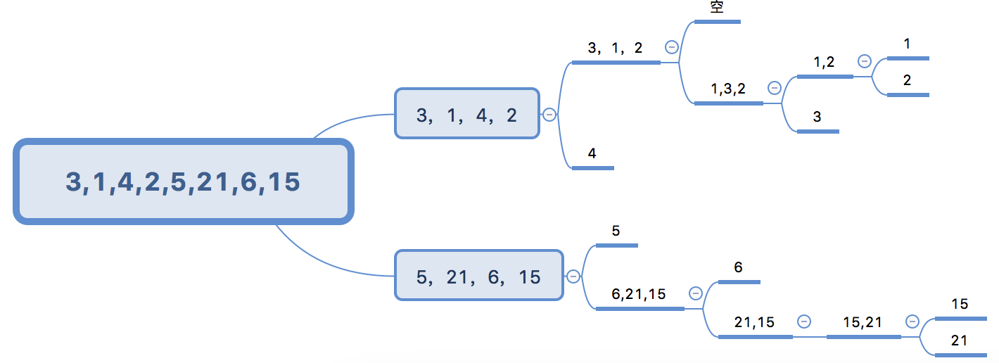

# 数组排序算法

- 冒泡排序
- 快速排序
- 插入排序

## 冒泡排序

```js
var arr = [12,10,13,8,4];
// target: [4,8,10,12,13] 从小到大排序
// 思想：当前项和后一项进行比较，如果当前项大于后一项，两者交换位置
/*
  第一轮比较四次，将最大的已经放到最后了，接下来下一轮，一共需要arr.length-1轮
  [10,12,13,8,4]
  [10,12,13,8,4]
  [10,12,8,13,4]
  [10,12,8,4,13]
  接下来第二轮比较三次

  i控制轮数，从0开始的话
  i=0第一轮 比较arr.length-1-0次
  i=1第一轮 比较arr.length-1-1次
  i=2第一轮 比较arr.length-1-2次
  ...
  i=n第n轮 比较arr.length-1-n次

  当当前项大于后一下交换位置
  var a = 12;
  var b = 13;
  var c = null;
  c = a;
  a = b;
  b = c
*/

function sortAry(ary){
  // i代表轮数，比较ary.length-1次
  for (var i = 0; i < ary.length-1; i++) {
    // 比较arr.length-1-i次，j代表每一轮比较的次数,不用和自己比，不用和上一轮最后一项的最大值比较
    for (var j = 0; j < ary.length-1-i; j++) {
      var cur = ary[j],next = ary[j+1];
      if (cur>next) {
        // 如果当前项大于下一项，交换位置
        var temp = null;
        temp = ary[j];
        ary[j] = ary[j+1];
        ary[j+1] = temp;
      }
    }
  }
}
sortAry(arr)
console.log(arr);
```

## 优化冒泡排序

[文章链接](https://mp.weixin.qq.com/s/9dkKBV2qBiPHIBCvtnzb-Q)

```js
// 假设一种场景，比如 8 1 2 3 5 7，进行一次排序之后，结果就变成了 1 2 3 5 7 8，就没有必要继续循环下去了
// 优化的点主要在于：假如某一趟排序之后已经有序，我们需要减少排序的趟数。否则就做了很多无用功。
function sortAry(ary){
  // i代表轮数，比较ary.length-1次
  for (var i = 0; i < ary.length-1; i++) {
    var exchange = false
    // 比较arr.length-1-i次，j代表每一轮比较的次数,不用和自己比，不用和上一轮最后一项的最大值比较
    for (var j = 0; j < ary.length-1-i; j++) {
      var cur = ary[j],next = ary[j+1];
      if (cur>next) {
        // 如果当前项大于下一项，交换位置
        var temp = null;
        temp = ary[j];
        ary[j] = ary[j+1];
        ary[j+1] = temp;
        exchange = true
      }
    }
    if (!exchange) {
      break
    }
  }
}
```

## 双向冒泡

普通的冒泡排序在一趟循环中只能找出一个最大值或最小值，双向冒泡则是多一轮循环既找出最大值也找出最小值

```js
function bubbleSort_twoWays(nums) {
  let low = 0;
  let high = nums.length - 1;
  while(low < high) {
    let mark = true;
    // 找到最大值放到右边
    for(let i=low; i<high; i++) {
      if(nums[i] > nums[i+1]) {
        [nums[i], nums[i+1]] = [nums[i+1], nums[i]];
        mark = false;
      }
    }
    high--;
    // 找到最小值放到左边
    for(let j=high; j>low; j--) {
      if(nums[j] < nums[j-1]) {
        [nums[j], nums[j-1]] = [nums[j-1], nums[j]];
        mark = false;
      }
    }
    low++;
    if(mark)  return;
  }
}
```

## 插入排序(INSERTION-SORT)

插入排序：对于少量元素比较有效。

```js
// 插入排序第一版
function sort(elements){
  //假设第0个元素是一个有序的数列，第1个以后的是无序的序列，
  //所以从第1个元素开始将无序数列的元素插入到有序数列中
  for(var i = 1; i < elements.length; i++){
    //升序
    if(elements[i] < elements[i-1]){
      //取出无序数列中的第i个作为被插入元素
      var guard = elements[i];
      //记住有序数列的最后一个位置，并且将有序数列位置扩大一个
      var j = i - 1;
      // elements[i] = elements[j]; // 我发现这句是多余的

      //比大小，找到被插入元素所在的位置
      while(j >= 0 && guard < elements[j]){
        elements[j+1] = elements[j];
        j--;
      }

      //插入
      elements[j+1] = guard;
    }
  }
}

var elements = [10, 9, 8, 7, 6, 5];
console.log('before: ' + elements);
sort(elements);
console.log(' after: ' + elements);

// 插入排序第二版
function insertionSort (arr) {
  let len = arr.length
  let j, temp
  for (let i = 1; i < length; i++) {
    j = i
    temp = arr[i]
    while (j > 0 && array[j - 1] > temp) {
      arr[j] = arr[j - 1]
      j--
    }
    if (j !== i) {
      arr[j] = temp
    }
  }
}
```

## 选择排序

选择排序大致的思路是找到数据结构中的最小值并将其放到第一位，接着找到第二小的值放到第二位。和冒泡排序相似，区别在于选择排序是将每一个元素和它后面的元素进行比较和交换

时间复杂度 O(n^2)

```js
function swap(arr, index1, index2) {
  let aux = arr[index1]
  arr[index1] = arr[index2]
  arr[index2] = aux
}
function selectionSort (array) {
  let length = array.length
  let indexMin // 最小值的索引
  for (let i = 0; i < length - 1; i++) {
    indexMin = i
    for (let j = i + 1; j < length; j++) {
      if (array[indexMin] > array[j]) {
        indexMin = j
      }
    }
    if (i !== indexMin) {
      swap(array, i, indexMin)
    }
  }
}
let arr = [4, 8, 2]
selectionSort(arr)
console.log(arr)
```

```js
// 简写的选择排序，但是存在多次交换的问题
function selectSort(nums) {
  for(let i=0, len=nums.length; i<len; i++) {
    for(let j=i+1; j<len; j++) {
      if(nums[i] > nums[j]) {
        [nums[i], nums[j]] = [nums[j], nums[i]];
      }
    }
  }
}
```


## 归并排序

归并排序是第一个可以被实际使用的排序算法。比前几个性能好。复杂度为 O(nlogn)

归并排序是一种分治算法。其思想是将原始的数组切分为较小的数组，直到每个小数组只有一个位置，接着将小数组归并成较大的数组，直到最后只有一个排序完毕的大数组。

```js
const Compare = {
  LESS_THAN: -1,
  BIGGER_THAN: 1,
  EQUALS: 0
};
function defaultCompare (a, b) {
  if (a === b) {
    return Compare.EQUALS;
  }
  return a < b ? Compare.LESS_THAN : Compare.BIGGER_THAN;
}

// 归并函数
function merge (left, right, compareFn) {
  let i = 0;
  let j = 0;
  const result = [];
  while (i < left.length && j < right.length) {
    result.push(compareFn(left[i], right[j]) === Compare.LESS_THAN ? left[i++] : right[j++]);
  }
  return result.concat(i < left.length ? left.slice(i) : right.slice(j));
}
// 切分大数组
function mergeSort (array, compareFn = defaultCompare) {
  if (array.length > 1) {
    const { length } = array;
    const middle = Math.floor(length / 2);
    const left = mergeSort(array.slice(0, middle), compareFn);
    const right = mergeSort(array.slice(middle, length), compareFn);
    array = merge(left, right, compareFn);
  }
  return array;
}

// 上边的简写
// 归并函数，这个函数主要负责将传入的两个数组进行排序
function merge (left, right) {
  let i = 0; // i,j 为 left right 的左右两个指针
  let j = 0;
  const result = [];
  while (i < left.length && j < right.length) {
    // 将小的数依次插入到 result 中，同时移动左右指针，知道某个数组遍历完了，即某个数组的指针停到了数组结尾，但是总有一个数组是不会被遍历完的，即指针没有停到数组的结尾，那么剩下的就是大的数据了，所以在 return 处做了一次 concat
    result.push(left[i] < right[j] ? left[i++] : right[j++]);
  }
  return result.concat(i < left.length ? left.slice(i) : right.slice(j));
}
// 切分大数组
function mergeSort (array) {
  if (array.length > 1) {
    const { length } = array;
    const middle = Math.floor(length / 2);
    const left = mergeSort(array.slice(0, middle));
    const right = mergeSort(array.slice(middle, length));
    array = merge(left, right);
  }
  return array;
}

let arr = [4, 8, 2]
console.log(mergeSort(arr))
```

## 快速排序

快速排序也许是最常用的排序算法了。它的复杂度是 O(nlogn)，且它的性能通常比其他的复杂度为 O(nlogn) 的排序算法要好。

快速排序也是采用分治的方法，将原始数组分为较小的数组。

第一种快速排序。不太好， splice 性能较差，因为 splice 每次操作都会创建新的数组，空间复杂度较高。从数组的中间拿一个值，然后通过这个值挨个和数组里面的值进行比较，如果大于的放一边，小于的放一边，然后把这些合并，再进行比较，如此反复即可。
```js
var arr = [3,1,4,2,5,21,6,15,63];
function sortA(arr){
  // 如果只有一位，就没有必要比较
  if(arr.length<=1){
      return arr;
  }
  // 获取中间值的索引
  var len = Math.floor(arr.length/2);
  // 截取中间值
  var cur = arr.splice(len,1);
  // 小于中间值放这里面
  var left = [];
  // 大于的放着里面
  var right = [];
  for(var i=0;i<arr.length;i++){
      // 判断是否大于
      if(cur>arr[i]){
          left.push(arr[i]);
      }else{
          right.push(arr[i]);
      }
  }
  // 通过递归，上一轮比较好的数组合并，并且再次进行比较。
  console.log(sortA(left).concat(cur,sortA(right)))
  return sortA(left).concat(cur,sortA(right))
}
console.log(sortA(arr));
```
额，理解起来比较难，画了个图


第二种快速排序，和归并排序类似，也使用分治的方法，将原始数组分为较小的数组(但它没有像归并排序那样将它们分割开)。

- 首先，从数组中选择中间一项作为主元
- 创建两个指针，左边一个指向数组第一项，右边一个指向数组最后一项。移动左指针直到我们找到一个比主元大的元素，接着移动右指针直到找到一个比主元素小的元素，然后交换它们，重复这个过程，直到左指针超过了右指针。这个过程将使得比主元小的值都排在主元之前，而比主元大的元素都排在主元之后。这一步叫作划分操作
- 接着，算法对划分后的小数组(较主元小的值组成的子数组，以及较主元大的值组成的子数组)重复之前的两个步骤，直至数组已完全排序

```js
function swap(array, a, b) {
  /* const temp = array[a];
  array[a] = array[b];
  array[b] = temp; */
  [array[a], array[b]] = [array[b], array[a]];
}

function partition(array, left, right) {
  const pivot = array[Math.floor((right + left) / 2)]; // 取中间值
  let i = left;
  let j = right;

  while (i <= j) {
    while (array[i] < pivot) {
      i++; // 如果左边的指针的值小于中间值，符合条件，移动左指针，最多移动到中间的这个值的位置
    }
    while (array[j] > pivot) {
      j--; // 如果右边的指针的值大于中间值，符合条件，移动右指针，最多移动到中间的这个值的位置
    }
    if (i <= j) { // 如果 i <= j 说明在上边的两个 while 循环中某个地方停住了，交换位置，同时移动指针
      swap(array, i, j);
      i++;
      j--;
    }
  }
  return i;
}
function quick(array, left, right) {
  let index;
  if (array.length > 1) {
    index = partition(array, left, right);
    if (left < index - 1) {
      quick(array, left, index - 1);
    }
    if (index < right) {
      quick(array, index, right);
    }
  }
  return array;
}
export function quickSort(array) {
  return quick(array, 0, array.length - 1);
}
```

## 堆排序

-----没看懂

堆排序也是一种很高效的算法，因其把数组当作二叉树来排序而得名。这个算法会根据以下信息，把数组当作二叉树来管理。

- 索引 0 是树的根节点
- 除根节点外，任意节点 N 的父节点是 N/2
- 节点 L 的左子节点是 2*L
- 节点 R 的右子节点是 2*R + 1

```js
function defaultCompare(a, b) {
  if (a === b) {
    return Compare.EQUALS;
  }
  return a < b ? Compare.LESS_THAN : Compare.BIGGER_THAN;
}

function swap(array, a, b) {
  /* const temp = array[a];
  array[a] = array[b];
  array[b] = temp; */
  [array[a], array[b]] = [array[b], array[a]];
}

function heapify(array, index, heapSize, compareFn) {
  let largest = index;
  const left = (2 * index) + 1;
  const right = (2 * index) + 2;
  if (left < heapSize && compareFn(array[left], array[index]) > 0) {
    largest = left;
  }
  if (right < heapSize && compareFn(array[right], array[largest]) > 0) {
    largest = right;
  }
  if (largest !== index) {
    swap(array, index, largest);
    heapify(array, largest, heapSize, compareFn);
  }
}

function buildMaxHeap(array, compareFn) {
  for (let i = Math.floor(array.length / 2); i >= 0; i -= 1) {
    heapify(array, i, array.length, compareFn);
  }
  return array;
}

// 堆排序算法
function heapSort(array, compareFn = defaultCompare) {
  let heapSize = array.length;
  buildMaxHeap(array, compareFn); // 第一步 构建一个满足 array[parent(i)] >= array[i] 的堆结构
  while (heapSize > 1) {
    swap(array, 0, --heapSize); // 第二步 交换堆里第一个元素(数组中较大的值)和最后一个元素的位置。这样，最大的值就会出现在它已排序的位置
    heapify(array, 0, heapSize, compareFn); // 第二步可能会丢掉堆的属性，因此，需要执行一个 heapify 的函数，再次将数组转换成堆，也就是说，它会找到当前的根节点(较小的值)，重新放回到树的底部
  }
  return array;
}
```

## 分布式排序

分布式排序算法：原始数组中的数据会分发到多个中间结构(桶)，在合起来放回原始数组。

最著名的分布式算法有计数排序、桶排序和基数排序。这三种算法非常相似。

### 计数排序

```js
// 找到数组中最大的值
function findMaxValue(array) {
  if (array && array.length > 0) {
    let max = array[0];
    for (let i = 1; i < array.length; i++) {
      if (max < array[i]) {
        max = array[i];
      }
    }
    return max;
  }
  return undefined;
}
// 计数排序
function countingSort(array) {
  if (array.length < 2) {
    return array;
  }
  const maxValue = findMaxValue(array); // 找到原有数组中最大的值
  let sortedIndex = 0;
  const counts = new Array(maxValue + 1); // 根据最大值生成一个数组
  array.forEach(element => {
    if (!counts[element]) {
      counts[element] = 0;
    }
    counts[element]++;
  });
  // console.log('Frequencies: ' + counts.join()); // Frequencies: ,1,,1,,,1 注意这里，相当于将原有数组按大小排到一起，比如原有数组中有一个1，则 counts 在 1 的位置记 1，如果有两个就计2。例如 counts 位 [, 3, , 1] 说明原数组中包含： [1, 1, 1, 3]
  counts.forEach((element, i) => {
    // 遍历 counts，此时的 counts 已经记录了数组中各个值的数量，只要根据每个数值的数量依次插入到 array 中就完成排序
    while (element > 0) {
      array[sortedIndex++] = i;
      element--;
    }
  });
  return array;
}

console.log(countingSort([1, 6, 3]))
```

### 捅排序

[最简单的桶排序](http://wiki.jikexueyuan.com/project/easy-learn-algorithm/bucket-sort.html)

-----没看

```js
import { insertionSort } from './insertion-sort'; // 这个是上边 第二种 插入排序

function createBuckets(array, bucketSize) {
  let minValue = array[0];
  let maxValue = array[0];
  for (let i = 1; i < array.length; i++) {
    if (array[i] < minValue) {
      minValue = array[i];
    } else if (array[i] > maxValue) {
      maxValue = array[i];
    }
  }
  const bucketCount = Math.floor((maxValue - minValue) / bucketSize) + 1;
  const buckets = [];
  for (let i = 0; i < bucketCount; i++) {
    buckets[i] = [];
  }
  for (let i = 0; i < array.length; i++) {
    buckets[Math.floor((array[i] - minValue) / bucketSize)].push(array[i]);
  }
  return buckets;
}
function sortBuckets(buckets) {
  const sortedArray = [];
  for (let i = 0; i < buckets.length; i++) {
    if (buckets[i] != null) {
      insertionSort(buckets[i]);
      sortedArray.push(...buckets[i]);
    }
  }
  return sortedArray;
}
// 桶排序
function bucketSort(array, bucketSize = 5) {
  if (array.length < 2) {
    return array;
  }
  const buckets = createBuckets(array, bucketSize);
  return sortBuckets(buckets);
}
```

### 基数排序

-----没看

```js
function findMaxValue(array) {
  if (array && array.length > 0) {
    let max = array[0];
    for (let i = 1; i < array.length; i++) {
      if (max < array[i]) {
        max = array[i];
      }
    }
    return max;
  }
  return undefined;
}
function findMinValue(array) {
  if (array && array.length > 0) {
    let min = array[0];
    for (let i = 1; i < array.length; i++) {
      if (min > array[i]) {
        min = array[i];
      }
    }
    return min;
  }
  return undefined;
}

const getBucketIndex = (value, minValue, significantDigit, radixBase) =>
  Math.floor(((value - minValue) / significantDigit) % radixBase);

const countingSortForRadix = (array, radixBase, significantDigit, minValue) => {
  let bucketsIndex;
  const buckets = [];
  const aux = [];
  for (let i = 0; i < radixBase; i++) {
    buckets[i] = 0;
  }
  for (let i = 0; i < array.length; i++) {
    bucketsIndex = getBucketIndex(array[i], minValue, significantDigit, radixBase);
    buckets[bucketsIndex]++;
  }
  for (let i = 1; i < radixBase; i++) {
    buckets[i] += buckets[i - 1];
  }
  for (let i = array.length - 1; i >= 0; i--) {
    bucketsIndex = getBucketIndex(array[i], minValue, significantDigit, radixBase);
    aux[--buckets[bucketsIndex]] = array[i];
  }
  for (let i = 0; i < array.length; i++) {
    array[i] = aux[i];
  }
  return array;
};

// 基数排序
function radixSort(array, radixBase = 10) {
  if (array.length < 2) {
    return array;
  }
  const minValue = findMinValue(array);
  const maxValue = findMaxValue(array);
  // Perform counting sort for each significant digit, starting at 1
  let significantDigit = 1;
  while ((maxValue - minValue) / significantDigit >= 1) {
    // console.log('radix sort for digit ' + significantDigit);
    array = countingSortForRadix(array, radixBase, significantDigit, minValue);
    // console.log(array.join());
    significantDigit *= radixBase;
  }
  return array;
}
```

## 希尔排序

[参考文章](https://www.cnblogs.com/chengxiao/p/6104371.html)

```js
function shellSort(array) {
  let increment = Math.floor(array.length / 2);
  while (increment > 0) {
    for (let i = increment; i < array.length; i++) {
      let j = i;
      const temp = array[i];
      while (j >= increment && array[j - increment] > temp) {
        array[j] = array[j - increment];
        j -= increment;
      }
      array[j] = temp;
    }
    if (increment === 2) {
      increment = 1;
    } else {
      increment = Math.floor((increment * 5) / 11);
    }
  }
  return array;
}
```